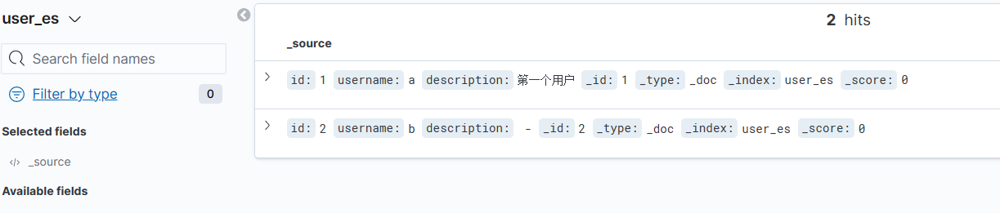

## 简介

FlinkCDC 是一个基于 Apache Flink 的实时数据流处理框架，可以捕获任意数据源的变更信息，将其转换为数据流，并利用 Flink 的流式处理能力进行实时的增量数据处理和实时 ETL 等操作。FlinkCDC 支持 SQL 数据库、NoSQL、Hive 等多种数据源，实现了高效的数据捕获能力和 Exactly-Once 语义的数据处理，具备高性能、可扩展性和灵活性等优点，可以满足大规模、实时处理的需求。

可用作数据同步，如 MySql 数据库向 ElasticSearch 同步

## 快速上手

### 使用 sql Client

演示 Mysql 向 ElasticSearch 同步

环境准备：

+ 安装了 docker 的 linux 主机

开始：

1. 新建 docker-compose.yml

```yaml
version: '2.1'
services:
  mysql:
    image: debezium/example-mysql:1.1
    ports:
      - "3306:3306"
    environment:
      - MYSQL_ROOT_PASSWORD=123456
      - MYSQL_USER=mysqluser
      - MYSQL_PASSWORD=mysqlpw
  elasticsearch:
    image: elastic/elasticsearch:7.6.0
    environment:
      - cluster.name=docker-cluster
      - bootstrap.memory_lock=true
      - "ES_JAVA_OPTS=-Xms512m -Xmx512m"
      - discovery.type=single-node
    ports:
      - "9200:9200"
      - "9300:9300"
    ulimits:
      memlock:
        soft: -1
        hard: -1
      nofile:
        soft: 65536
        hard: 65536
  kibana:
    image: elastic/kibana:7.6.0
    ports:
      - "5601:5601"
```

使用命令启动 `docker-compose up -d`

2. 连接 mysql 数据库，创建一个数据库 demo，创建一张表 user_table，插入一条数据

```sql
CREATE DATABASE `demo`;

CREATE TABLE demo.user_table (
	id bigint auto_increment NOT NULL,
	username varchar(100) NOT NULL,
	description varchar(100) NULL,
	CONSTRAINT user_table_PK PRIMARY KEY (id),
	CONSTRAINT user_table_UN UNIQUE KEY (username)
)
ENGINE=InnoDB
DEFAULT CHARSET=utf8
COLLATE=utf8_general_ci;

INSERT INTO demo.user_table
(id, username, description)
VALUES(1, 'xiaoso', ' 第一个用户 ');

```

3. 下载 flink1.16.0 ` curl -O https://archive.apache.org/dist/flink/flink-1.16.0/flink-1.16.0-bin-scala_2.12.tgz`

   解压 `tar -zxvf flink-1.16.0-bin-scala_2.12.tgz `

   进入 `flink-1.16.0/lib` 文件夹，下载 es 和 mysql 连接器

   + 下载 es 连接器`curl -O https://repo.maven.apache.org/maven2/org/apache/flink/flink-sql-connector-elasticsearch7/1.16.0/flink-sql-connector-elasticsearch7-1.16.0.jar`
   + 下载 mysql 连接器`curl -O https://repo1.maven.org/maven2/com/ververica/flink-sql-connector-mysql-cdc/2.3.0/flink-sql-connector-mysql-cdc-2.3.0.jar`

4. 修改 `conf/flink-conf.yaml`如下几行

```yaml
taskmanager.numberOfTaskSlots: 50
```

5. 启动 flink 服务端 `./bin/start-cluster.sh`
6. 启动 flink sql client `./bin/sql-client.sh`，并在客户端中输入以下命令

```sql
 -- 开启 checkpoint，每隔 3 秒做一次 checkpoint
 SET execution.checkpointing.interval = 3s;
 -- 把 mysql 的 user_table 表作为数据源，创建 flink 中的 user_table 表
CREATE TABLE user_table (
    id bigint,
    username STRING,
    description STRING,
    PRIMARY KEY (id) NOT ENFORCED
  ) WITH (
    'connector' = 'mysql-cdc',
    'hostname' = 'localhost',
    'port' = '3306',
    'username' = 'root',
    'password' = '123456',
    'database-name' = 'demo',
    'table-name' = 'user_table',
    'server-time-zone' = 'GMT'
  );
  
  -- 创建 user_es 表，写入到 es
  CREATE TABLE user_es (
    id bigint,
    username STRING,
    description STRING,
    PRIMARY KEY (id) NOT ENFORCED
 ) WITH (
     'connector' = 'elasticsearch-7',
     'hosts' = 'http://192.168.229.128:9200',
     'index' = 'user_es'
 );
 
 -- 写入 es
 insert into user_es
 select * from user_table;
```

7. 打开 kibana 页面，新建索引，可以看到同步的用户



### 使用代码

maven 添加依赖

```xml
        <dependency>
            <groupId>org.apache.flink</groupId>
            <artifactId>flink-connector-base</artifactId>
            <version>1.16.0</version>
        </dependency>
        <!--mysql 连接器-->
        <dependency>
            <groupId>com.ververica</groupId>
            <artifactId>flink-connector-mysql-cdc</artifactId>
            <version>2.3.0</version>
        </dependency>
        <!-- Flink dataStream api-->
        <dependency>
            <groupId>org.apache.flink</groupId>
            <artifactId>flink-streaming-java</artifactId>
            <version>1.16.0</version>
        </dependency>
        <!--Flink table api-->
        <dependency>
            <groupId>org.apache.flink</groupId>
            <artifactId>flink-table-api-java</artifactId>
            <version>1.16.0</version>
        </dependency>
        <!--java 客户端-->
        <dependency>
            <groupId>org.apache.flink</groupId>
            <artifactId>flink-clients</artifactId>
            <version>1.16.0</version>
        </dependency>
        <!--web ui-->
        <dependency>
            <groupId>org.apache.flink</groupId>
            <artifactId>flink-runtime-web</artifactId>
            <version>1.16.0</version>
        </dependency>

        <dependency>
            <groupId>ch.qos.logback</groupId>
            <artifactId>logback-classic</artifactId>
            <version>1.2.11</version>
        </dependency>
        <dependency>
            <groupId>org.slf4j</groupId>
            <artifactId>slf4j-api</artifactId>
            <version>1.7.36</version>
        </dependency>
```

添加打包插件，使用 package 可以打成独立包

```xml
  <build>
        <!--<sourceDirectory>src/main/java/com/github/xiaoso456</sourceDirectory>-->
        <plugins>
            <plugin>
                <groupId>org.apache.maven.plugins</groupId>
                <artifactId>maven-assembly-plugin</artifactId>
                <version>3.1.1</version>
                <configuration>
                    <descriptorRefs>jar-with-dependencies</descriptorRefs>
                    <archive>
                        <manifest>
                            <mainClass>com.github.xiaoso456.FlinkCDC</mainClass>
                        </manifest>
                    </archive>
                </configuration>
                <executions>
                    <execution>
                        <id>make-assembly</id>
                        <phase>package</phase>
                        <goals>
                            <goal>single</goal>
                        </goals>
                    </execution>
                </executions>
            </plugin>
        </plugins>
    </build>
```


添加 Flink.java

```java
package com.github.xiaoso456;

import com.ververica.cdc.connectors.mysql.source.MySqlSource;
import com.ververica.cdc.connectors.mysql.table.StartupOptions;
import com.ververica.cdc.debezium.StringDebeziumDeserializationSchema;
import org.apache.flink.api.common.eventtime.WatermarkStrategy;
import org.apache.flink.configuration.Configuration;
import org.apache.flink.configuration.RestOptions;
import org.apache.flink.streaming.api.environment.StreamExecutionEnvironment;

public class FlinkCDC {
   public static void main(String[] args) throws Exception {
      Configuration configuration = new Configuration();
      configuration.setInteger(RestOptions.PORT,8081);
      StreamExecutionEnvironment env = StreamExecutionEnvironment.getExecutionEnvironment(configuration);


      MySqlSource<String> source = MySqlSource.<String>builder()
              .hostname("192.168.229.128")
              .port(13306)
              .username("root")
              .password("123456")
              .databaseList("demo")
              .tableList("demo.user_table")
              .serverTimeZone("UTC")
              // 序列化器
              .deserializer(new StringDebeziumDeserializationSchema())
              // 启动方式，查询一次全量数据，然后监听 binlog
              .startupOptions(StartupOptions.initial())
              .build();

      // sink 下游
      env.enableCheckpointing(3000);
      env.fromSource(source, WatermarkStrategy.noWatermarks(), "MySQL Source")
              .setParallelism(1)
              .print().setParallelism(1);
      // 启动 job
      env.execute("Print MySQL Snapshot + Binlog");

   }
}
```


## 参考

[快速上手 — Flink CDC documentation (ververica.github.io)](https://ververica.github.io/flink-cdc-connectors/release-2.1/content/快速上手/index.html)