## 简介

async tool 是京东开源的Java并发编排工具，用于解决任意的多线程并行、串行、阻塞、依赖、回调的并发框架，可以任意组合各线程的执行顺序，带全链路回调和超时控制。

## 基本组件
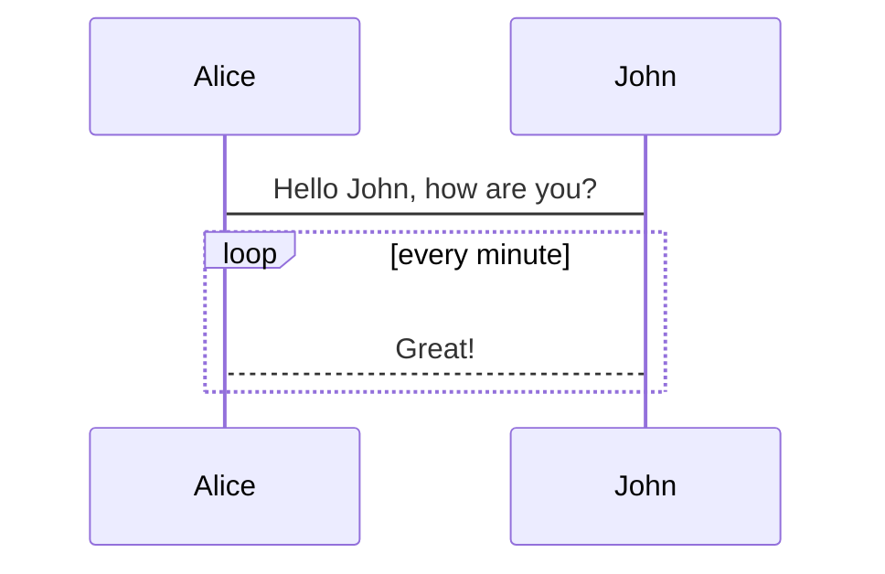
### worker

worker 是最小任务执行单位，通常是一个网络调用，或一段耗时操作。

worker 接口如下，T是入参类型，V是出参类型

```java
@FunctionalInterface
public interface IWorker<T, V> {
    /**
     * 在这里做耗时操作，如rpc请求、IO等
     *
     * @param object      object
     * @param allWrappers 任务包装
     */
    V action(T object, Map<String, WorkerWrapper> allWrappers);

    /**
     * 超时、异常时，返回的默认值
     *
     * @return 默认值
     */
    default V defaultValue() {
        return null;
    }
}

```

### callback

callBack：对每个worker的回调。worker执行完毕后，会回调该接口，带着执行成功、失败、原始入参、和详细的结果。T 是原始入参类型，V是出参

```java
@FunctionalInterface
public interface ICallback<T, V> {

    /**
     * 任务开始的监听
     */
    default void begin() {

    }

    /**
     * 耗时操作执行完毕后，就给value注入值
     */
    void result(boolean success, T param, WorkResult<V> workResult);
}

```

### wrapper

组合了worker和callback，是一个 **最小的调度单元** 。通过编排wrapper之间的关系，达到组合各个worker顺序的目的。

T是入参，V是出参

```java
/**
 * 对每个worker及callback进行包装，一对一
 */
public class WorkerWrapper<T, V>{
    // 省略
}
```

## 示例

### 任务编排1-三个任务并行

下面开启了三个并行任务 `w`、`w1`、`w2`

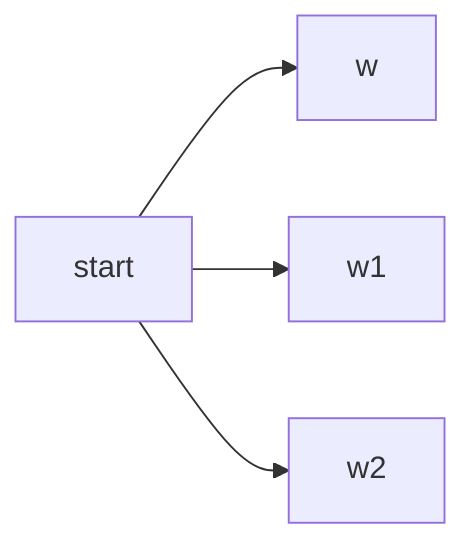


::: details
```java
public class Demo1 {
    public static void main(String[] args) throws ExecutionException, InterruptedException {
        ParWorker w = new ParWorker();
        ParWorker1 w1 = new ParWorker1();
        ParWorker2 w2 = new ParWorker2();

        WorkerWrapper<String, String> workerWrapper2 =  new WorkerWrapper.Builder<String, String>()
                .worker(w2)
                .callback(w2)
                .param("2")
                .build();

        WorkerWrapper<String, String> workerWrapper1 =  new WorkerWrapper.Builder<String, String>()
                .worker(w1)
                .callback(w1)
                .param("1")
                .build();

        WorkerWrapper<String, String> workerWrapper =  new WorkerWrapper.Builder<String, String>()
                .worker(w)
                .callback(w)
                .param("0")
                .build();

        long now = SystemClock.now();
        System.out.println("begin-" + now);

        Async.beginWork(1500, workerWrapper, workerWrapper1, workerWrapper2);
       // Async.beginWork(800, workerWrapper, workerWrapper1, workerWrapper2);
       // Async.beginWork(1000, workerWrapper, workerWrapper1, workerWrapper2);

        System.out.println("end-" + SystemClock.now());
        System.err.println("cost-" + (SystemClock.now() - now));
        System.out.println(Async.getThreadCount());

        System.out.println(workerWrapper.getWorkResult());
        Async.shutDown();
    }
}
```
:::
### 任务编排2

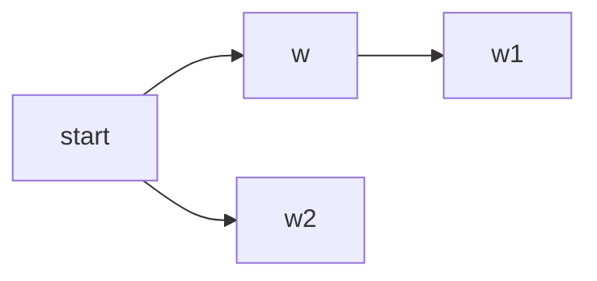
::: details
```java
public class Demo2 {

    /**
     * 0,2同时开启,1在0后面
     * 0---1
     * 2
     */
    public static void main(String[] args) throws ExecutionException, InterruptedException {
        ParWorker w = new ParWorker();
        ParWorker1 w1 = new ParWorker1();
        ParWorker2 w2 = new ParWorker2();

        WorkerWrapper<String, String> workerWrapper2 =  new WorkerWrapper.Builder<String, String>()
                .worker(w2)
                .callback(w2)
                .param("2")
                .build();

        WorkerWrapper<String, String> workerWrapper1 =  new WorkerWrapper.Builder<String, String>()
                .worker(w1)
                .callback(w1)
                .param("1")
                .build();

        WorkerWrapper<String, String> workerWrapper =  new WorkerWrapper.Builder<String, String>()
                .worker(w)
                .callback(w)
                .param("0")
                .next(workerWrapper1)
                .build();

        long now = SystemClock.now();
        System.out.println("begin-" + now);

        Async.beginWork(2500, workerWrapper, workerWrapper2);

        System.out.println("end-" + SystemClock.now());
        System.err.println("cost-" + (SystemClock.now() - now));


    }
}

```
:::
反转写法：
::: details
```java
public class Demo2R {

    /**
     * 0,2同时开启,1在0后面
     * 0---1
     * 2
     */
    public static void main(String[] args) throws ExecutionException, InterruptedException {
        ParWorker w = new ParWorker();
        ParWorker1 w1 = new ParWorker1();
        ParWorker2 w2 = new ParWorker2();

        WorkerWrapper<String, String> workerWrapper =  new WorkerWrapper.Builder<String, String>()
                .worker(w)
                .callback(w)
                .param("0")
                .build();

        WorkerWrapper<String, String> workerWrapper1 =  new WorkerWrapper.Builder<String, String>()
                .worker(w1)
                .callback(w1)
                .param("1")
                .depend(workerWrapper)
                .build();

        WorkerWrapper<String, String> workerWrapper2 =  new WorkerWrapper.Builder<String, String>()
                .worker(w2)
                .callback(w2)
                .param("2")
                .build();


        long now = SystemClock.now();
        System.out.println("begin-" + now);

        Async.beginWork(2500, workerWrapper, workerWrapper2);

        System.out.println("end-" + SystemClock.now());
        System.err.println("cost-" + (SystemClock.now() - now));

        Async.shutDown();

    }
}

```
:::
### 任务编排3-组超时


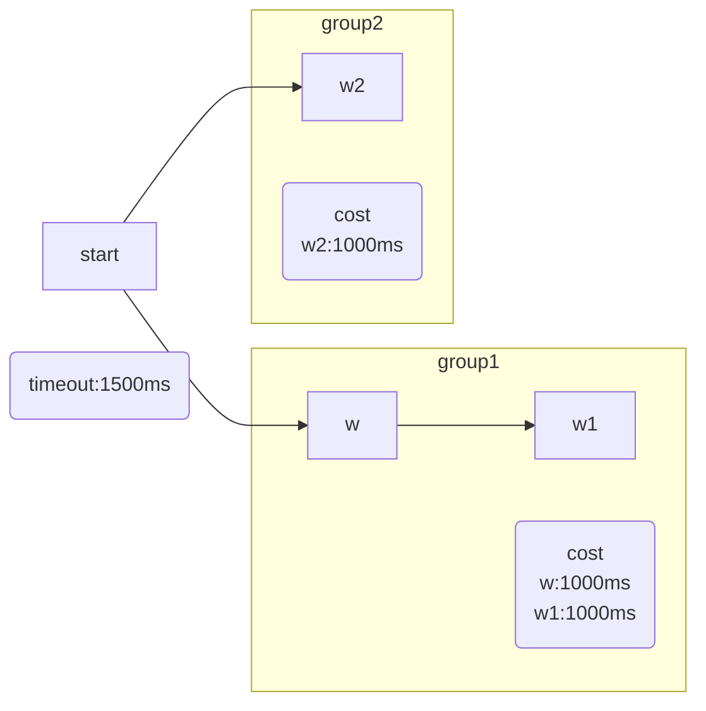


::: details
```java

public class Demo3 {

    /**
     * 0,2同时开启,1在0后面. 组超时,则0和2成功,1失败
     * 0---1
     * 2
     */
    public static void main(String[] args) throws ExecutionException, InterruptedException {
        ParWorker w = new ParWorker();
        ParWorker1 w1 = new ParWorker1();
        ParWorker2 w2 = new ParWorker2();

        WorkerWrapper<String, String> workerWrapper2 =  new WorkerWrapper.Builder<String, String>()
                .worker(w2)
                .callback(w2)
                .param("2")
                .build();

        WorkerWrapper<String, String> workerWrapper1 =  new WorkerWrapper.Builder<String, String>()
                .worker(w1)
                .callback(w1)
                .param("1")
                .build();

        WorkerWrapper<String, String> workerWrapper =  new WorkerWrapper.Builder<String, String>()
                .worker(w)
                .callback(w)
                .param("0")
                .next(workerWrapper1)
                .build();

        long now = SystemClock.now();
        System.out.println("begin-" + now);

        Async.beginWork(1500, workerWrapper, workerWrapper2);

        System.out.println("end-" + SystemClock.now());
        System.err.println("cost-" + (SystemClock.now() - now));

        Async.shutDown();

    }
}

```
:::
### 任务编排4

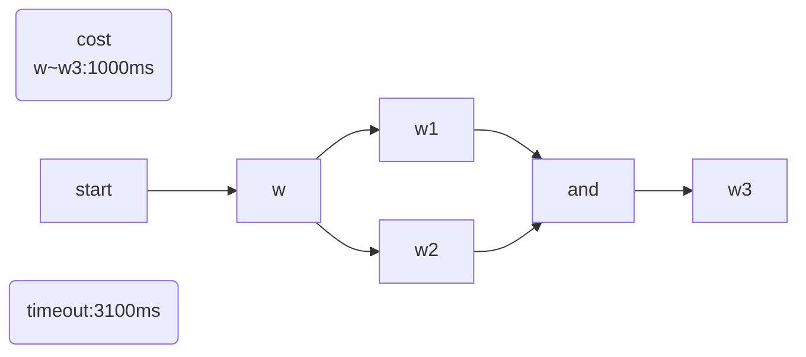


::: details
```java
public class Demo4 {

    /**
     * 0执行完,同时1和2, 1\2都完成后3
     *     1
     * 0       3
     *     2
     */
    public static void main(String[] args) throws ExecutionException, InterruptedException {
        ParWorker w = new ParWorker();
        ParWorker1 w1 = new ParWorker1();
        ParWorker2 w2 = new ParWorker2();
        ParWorker3 w3 = new ParWorker3();

        WorkerWrapper<String, String> workerWrapper3 =  new WorkerWrapper.Builder<String, String>()
                .worker(w3)
                .callback(w3)
                .param("3")
                .build();

        WorkerWrapper<String, String> workerWrapper2 =  new WorkerWrapper.Builder<String, String>()
                .worker(w2)
                .callback(w2)
                .param("2")
                .next(workerWrapper3)
                .build();

        WorkerWrapper<String, String> workerWrapper1 =  new WorkerWrapper.Builder<String, String>()
                .worker(w1)
                .callback(w1)
                .param("1")
                .next(workerWrapper3)
                .build();

        WorkerWrapper<String, String> workerWrapper =  new WorkerWrapper.Builder<String, String>()
                .worker(w)
                .callback(w)
                .param("0")
                .next(workerWrapper1, workerWrapper2)
                .build();


        long now = SystemClock.now();
        System.out.println("begin-" + now);

        Async.beginWork(3100, workerWrapper);
//        Async.beginWork(2100, workerWrapper);

        System.out.println("end-" + SystemClock.now());
        System.err.println("cost-" + (SystemClock.now() - now));

        System.out.println(Async.getThreadCount());
        Async.shutDown();
    }
}

```
:::
反转代码：
::: details
```java
public class Demo4R {

    /**
     * 0执行完,同时1和2, 1\2都完成后3
     *     1
     * 0       3
     *     2
     */
    public static void main(String[] args) throws ExecutionException, InterruptedException {
        ParWorker w = new ParWorker();
        ParWorker1 w1 = new ParWorker1();
        ParWorker2 w2 = new ParWorker2();
        ParWorker3 w3 = new ParWorker3();

        WorkerWrapper<String, String> workerWrapper =  new WorkerWrapper.Builder<String, String>()
                .worker(w)
                .callback(w)
                .param("0")
                .build();

        WorkerWrapper<String, String> workerWrapper2 =  new WorkerWrapper.Builder<String, String>()
                .worker(w2)
                .callback(w2)
                .param("2")
                .depend(workerWrapper)
                .build();

        WorkerWrapper<String, String> workerWrapper1 =  new WorkerWrapper.Builder<String, String>()
                .worker(w1)
                .callback(w1)
                .param("1")
                .depend(workerWrapper)
                .build();

        WorkerWrapper<String, String> workerWrapper3 =  new WorkerWrapper.Builder<String, String>()
                .worker(w3)
                .callback(w3)
                .param("3")
                .depend(workerWrapper1, workerWrapper2)
                .build();


        long now = SystemClock.now();
        System.out.println("begin-" + now);

        Async.beginWork(3100, workerWrapper);
//        Async.beginWork(2100, workerWrapper);

        System.out.println("end-" + SystemClock.now());
        System.err.println("cost-" + (SystemClock.now() - now));

        System.out.println(Async.getThreadCount());
        Async.shutDown();
    }
}

```
:::
### 任务编排5

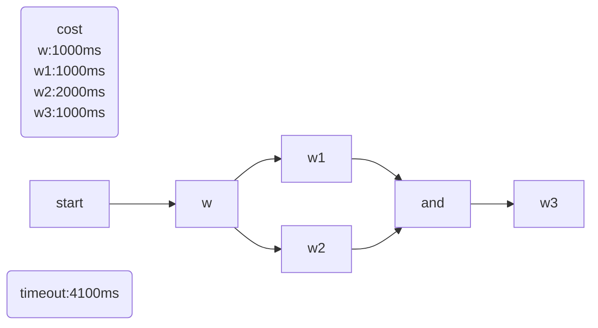


::: details
```java
public class Demo5 {

    /**
     * 0执行完,同时1和2, 1\2都完成后3，2耗时2秒，1耗时1秒。3会等待2完成
     *     1
     * 0       3
     *     2
     *
     * 执行结果0，1，2，3
     */
    public static void main(String[] args) throws ExecutionException, InterruptedException {
        ParWorker w = new ParWorker();
        ParWorker1 w1 = new ParWorker1();

        ParWorker2 w2 = new ParWorker2();
        w2.setSleepTime(2000);

        ParWorker3 w3 = new ParWorker3();

        WorkerWrapper<String, String> workerWrapper3 =  new WorkerWrapper.Builder<String, String>()
                .worker(w3)
                .callback(w3)
                .param("3")
                .build();

        WorkerWrapper<String, String> workerWrapper2 =  new WorkerWrapper.Builder<String, String>()
                .worker(w2)
                .callback(w2)
                .param("2")
                .next(workerWrapper3)
                .build();

        WorkerWrapper<String, String> workerWrapper1 =  new WorkerWrapper.Builder<String, String>()
                .worker(w1)
                .callback(w1)
                .param("1")
                .next(workerWrapper3)
                .build();

        WorkerWrapper<String, String> workerWrapper =  new WorkerWrapper.Builder<String, String>()
                .worker(w)
                .callback(w)
                .param("0")
                .next(workerWrapper1, workerWrapper2)
                .build();

        long now = SystemClock.now();
        System.out.println("begin-" + now);

        //正常完毕
        Async.beginWork(4100, workerWrapper);
        //3会超时
//        Async.beginWork(3100, workerWrapper);
        //2,3会超时
//        Async.beginWork(2900, workerWrapper);

        System.out.println("end-" + SystemClock.now());
        System.err.println("cost-" + (SystemClock.now() - now));

        System.out.println(Async.getThreadCount());
        Async.shutDown();
    }
}
```
:::
反转代码：
::: details
```java

public class Demo5R {

    /**
     * 0执行完,同时1和2, 1\2都完成后3，2耗时2秒，1耗时1秒。3会等待2完成
     *     1
     * 0       3
     *     2
     *
     * 执行结果0，1，2，3
     */
    public static void main(String[] args) throws ExecutionException, InterruptedException {
        ParWorker w = new ParWorker();
        ParWorker1 w1 = new ParWorker1();

        ParWorker2 w2 = new ParWorker2();
        w2.setSleepTime(2000);

        ParWorker3 w3 = new ParWorker3();

        WorkerWrapper<String, String> workerWrapper =  new WorkerWrapper.Builder<String, String>()
                .worker(w)
                .callback(w)
                .param("0")
                .build();

        WorkerWrapper<String, String> workerWrapper3 =  new WorkerWrapper.Builder<String, String>()
                .worker(w3)
                .callback(w3)
                .param("3")
                .build();

        WorkerWrapper<String, String> workerWrapper2 =  new WorkerWrapper.Builder<String, String>()
                .worker(w2)
                .callback(w2)
                .param("2")
                .depend(workerWrapper)
                .next(workerWrapper3)
                .build();

        WorkerWrapper<String, String> workerWrapper1 =  new WorkerWrapper.Builder<String, String>()
                .worker(w1)
                .callback(w1)
                .param("1")
                .depend(workerWrapper)
                .next(workerWrapper3)
                .build();

        long now = SystemClock.now();
        System.out.println("begin-" + now);

        //正常完毕
        Async.beginWork(4100, workerWrapper);
        //3会超时
//        Async.beginWork(3100, workerWrapper);
        //2,3会超时
//        Async.beginWork(2900, workerWrapper);

        System.out.println("end-" + SystemClock.now());
        System.err.println("cost-" + (SystemClock.now() - now));

        System.out.println(Async.getThreadCount());
        Async.shutDown();
    }
}

```
:::


### 任务编排6

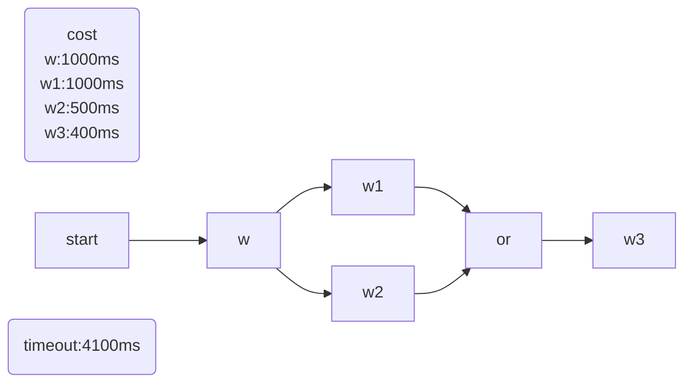


::: details
```java
    /**
     * 0执行完,同时1和2, 1\2 任何一个执行完后，都执行3
     *     1
     * 0       3
     *     2
     *
     * 则结果是：
     * 0，2，3，1
     * 2，3分别是500、400.3执行完毕后，1才执行完
     */
    public static void main(String[] args) throws ExecutionException, InterruptedException {
        ParWorker w = new ParWorker();
        ParWorker1 w1 = new ParWorker1();

        ParWorker2 w2 = new ParWorker2();
        w2.setSleepTime(500);

        ParWorker3 w3 = new ParWorker3();
        w3.setSleepTime(400);

        WorkerWrapper<String, String> workerWrapper3 =  new WorkerWrapper.Builder<String, String>()
                .worker(w3)
                .callback(w3)
                .param("3")
                .build();

        WorkerWrapper<String, String> workerWrapper2 =  new WorkerWrapper.Builder<String, String>()
                .worker(w2)
                .callback(w2)
                .param("2")
                .next(workerWrapper3, false)
                .build();

        WorkerWrapper<String, String> workerWrapper1 =  new WorkerWrapper.Builder<String, String>()
                .worker(w1)
                .callback(w1)
                .param("1")
                .next(workerWrapper3, false)
                .build();

        WorkerWrapper<String, String> workerWrapper =  new WorkerWrapper.Builder<String, String>()
                .worker(w)
                .callback(w)
                .param("0")
                .next(workerWrapper1, workerWrapper2)
                .build();

        long now = SystemClock.now();
        System.out.println("begin-" + now);

        //正常完毕
        Async.beginWork(4100, workerWrapper);

        System.out.println("end-" + SystemClock.now());
        System.err.println("cost-" + (SystemClock.now() - now));

        System.out.println(Async.getThreadCount());
        Async.shutDown();
    }
}

```
:::
反转代码：
::: details
```java
public class Demo6R {

    /**
     * 0执行完,同时1和2, 1\2 任何一个执行完后，都执行3
     *     1
     * 0       3
     *     2
     *
     * 则结果是：
     * 0，2，3，1
     * 2，3分别是500、400.3执行完毕后，1才执行完
     */
    public static void main(String[] args) throws ExecutionException, InterruptedException {
        ParWorker w = new ParWorker();
        ParWorker1 w1 = new ParWorker1();

        ParWorker2 w2 = new ParWorker2();
        w2.setSleepTime(500);

        ParWorker3 w3 = new ParWorker3();
        w3.setSleepTime(400);

        WorkerWrapper<String, String> workerWrapper =  new WorkerWrapper.Builder<String, String>()
                .worker(w)
                .callback(w)
                .param("0")
                .build();

        WorkerWrapper<String, String> workerWrapper3 =  new WorkerWrapper.Builder<String, String>()
                .worker(w3)
                .callback(w3)
                .param("3")
                .build();

        WorkerWrapper<String, String> workerWrapper2 =  new WorkerWrapper.Builder<String, String>()
                .worker(w2)
                .callback(w2)
                .param("2")
                .depend(workerWrapper, true)
                .next(workerWrapper3, false)
                .build();

        WorkerWrapper<String, String> workerWrapper1 =  new WorkerWrapper.Builder<String, String>()
                .worker(w1)
                .callback(w1)
                .param("1")
                .depend(workerWrapper, true)
                .next(workerWrapper3, false)
                .build();


        long now = SystemClock.now();
        System.out.println("begin-" + now);

        //正常完毕
        Async.beginWork(4100, workerWrapper);

        System.out.println("end-" + SystemClock.now());
        System.err.println("cost-" + (SystemClock.now() - now));

        System.out.println(Async.getThreadCount());
        Async.shutDown();
    }
}

```
:::


### 任务编排7

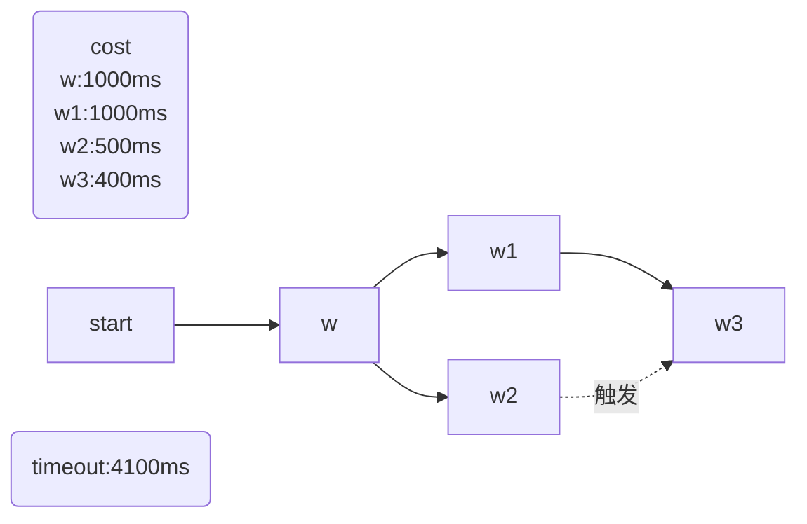


::: details
```java
    /**
     * 0执行完,同时1和2, 必须1执行完毕后，才能执行3. 无论2是否领先1完毕，都要等1
     *     1
     * 0       3
     *     2
     *
     * 则结果是：
     * 0，2，1，3
     *
     * 2，3分别是500、400.2执行完了，1没完，那就等着1完毕，才能3
     */
    public static void main(String[] args) throws ExecutionException, InterruptedException {
        ParWorker w = new ParWorker();
        ParWorker1 w1 = new ParWorker1();

        ParWorker2 w2 = new ParWorker2();
        w2.setSleepTime(500);

        ParWorker3 w3 = new ParWorker3();
        w3.setSleepTime(400);

        WorkerWrapper<String, String> workerWrapper3 =  new WorkerWrapper.Builder<String, String>()
                .worker(w3)
                .callback(w3)
                .param("3")
                .build();

        //设置2不是必须
        WorkerWrapper<String, String> workerWrapper2 =  new WorkerWrapper.Builder<String, String>()
                .worker(w2)
                .callback(w2)
                .param("2")
                .next(workerWrapper3, false)
                .build();
        // 设置1是必须的
        WorkerWrapper<String, String> workerWrapper1 =  new WorkerWrapper.Builder<String, String>()
                .worker(w1)
                .callback(w1)
                .param("1")
                .next(workerWrapper3, true)
                .build();

        WorkerWrapper<String, String> workerWrapper0 =  new WorkerWrapper.Builder<String, String>()
                .worker(w)
                .callback(w)
                .param("0")
                .next(workerWrapper2, workerWrapper1)
                .build();


        long now = SystemClock.now();
        System.out.println("begin-" + now);

        //正常完毕
        Async.beginWork(4100, workerWrapper0);

        System.out.println("end-" + SystemClock.now());
        System.err.println("cost-" + (SystemClock.now() - now));

        System.out.println(Async.getThreadCount());
        Async.shutDown();
    }
}

```
:::


### 任务编排8

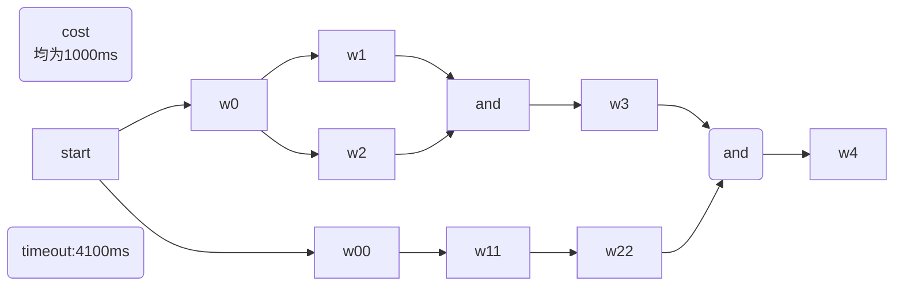


::: details
```java
public class Demo8 {

    /**
     * 两个0并行，上面0执行完,同时1和2, 下面0执行完开始1，上面的 必须1、2执行完毕后，才能执行3. 最后必须2、3都完成，才能4
     *     1
     * 0       3
     *     2        4
     * ---------
     * 0   1   2
     *
     * 则结果是：
     * callback worker0 success--1577242870969----result = 1577242870968---param = 00 from 0-threadName:Thread-1
     * callback worker0 success--1577242870969----result = 1577242870968---param = 0 from 0-threadName:Thread-0
     * callback worker1 success--1577242871972----result = 1577242871972---param = 11 from 1-threadName:Thread-1
     * callback worker1 success--1577242871972----result = 1577242871972---param = 1 from 1-threadName:Thread-2
     * callback worker2 success--1577242871973----result = 1577242871973---param = 2 from 2-threadName:Thread-3
     * callback worker2 success--1577242872975----result = 1577242872975---param = 22 from 2-threadName:Thread-1
     * callback worker3 success--1577242872977----result = 1577242872977---param = 3 from 3-threadName:Thread-2
     * callback worker4 success--1577242873980----result = 1577242873980---param = 4 from 3-threadName:Thread-2
     */
    public static void main(String[] args) throws ExecutionException, InterruptedException {
        ParWorker w = new ParWorker();
        ParWorker1 w1 = new ParWorker1();
        ParWorker2 w2 = new ParWorker2();
        ParWorker3 w3 = new ParWorker3();
        ParWorker4 w4 = new ParWorker4();

        WorkerWrapper<String, String> workerWrapper4 =  new WorkerWrapper.Builder<String, String>()
                .worker(w4)
                .callback(w4)
                .param("4")
                .build();

        WorkerWrapper<String, String> workerWrapper3 =  new WorkerWrapper.Builder<String, String>()
                .worker(w3)
                .callback(w3)
                .param("3")
                .next(workerWrapper4)
                .build();

        //下面的2
        WorkerWrapper<String, String> workerWrapper22 =  new WorkerWrapper.Builder<String, String>()
                .worker(w2)
                .callback(w2)
                .param("22")
                .next(workerWrapper4)
                .build();

        //下面的1
        WorkerWrapper<String, String> workerWrapper11 =  new WorkerWrapper.Builder<String, String>()
                .worker(w1)
                .callback(w1)
                .param("11")
                .next(workerWrapper22)
                .build();

        //下面的0
        WorkerWrapper<String, String> workerWrapper00 =  new WorkerWrapper.Builder<String, String>()
                .worker(w)
                .callback(w)
                .param("00")
                .next(workerWrapper11)
                .build();

        //上面的1
        WorkerWrapper<String, String> workerWrapper1 =  new WorkerWrapper.Builder<String, String>()
                .worker(w1)
                .callback(w1)
                .param("1")
                .next(workerWrapper3)
                .build();

        //上面的2
        WorkerWrapper<String, String> workerWrapper2 =  new WorkerWrapper.Builder<String, String>()
                .worker(w2)
                .callback(w2)
                .param("2")
                .next(workerWrapper3)
                .build();

        //上面的0
        WorkerWrapper<String, String> workerWrapper0 =  new WorkerWrapper.Builder<String, String>()
                .worker(w)
                .callback(w)
                .param("0")
                .next(workerWrapper1, workerWrapper2)
                .build();

        long now = SystemClock.now();
        System.out.println("begin-" + now);

        //正常完毕
        Async.beginWork(4100, workerWrapper00, workerWrapper0);

        System.out.println("end-" + SystemClock.now());
        System.err.println("cost-" + (SystemClock.now() - now));

        System.out.println(Async.getThreadCount());
        Async.shutDown();
    }
}

```
:::


### 任务编排9

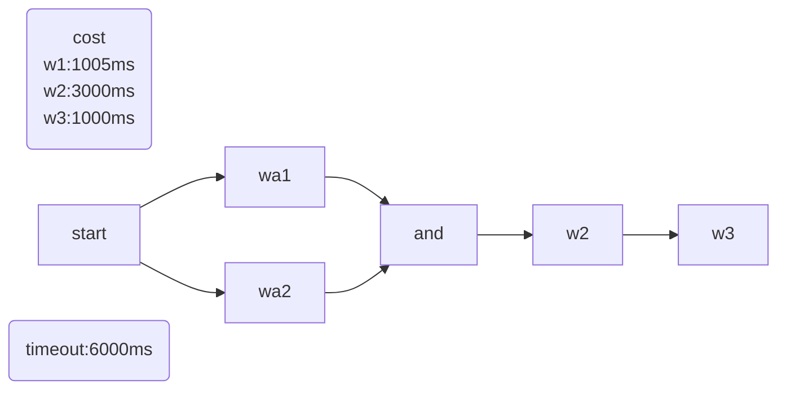


::: details
```java

public class Demo9 {

    /**
     * a1 -> b -> c
     * a2 -> b -> c
     *
     * b、c
     */
    public static void main(String[] args) throws ExecutionException, InterruptedException {
        ParWorker w = new ParWorker();
        ParWorker1 w1 = new ParWorker1();
        w1.setSleepTime(1005);

        ParWorker2 w2 = new ParWorker2();
        w2.setSleepTime(3000);
        ParWorker3 w3 = new ParWorker3();
        w3.setSleepTime(1000);

        WorkerWrapper<String, String> workerWrapper3 =  new WorkerWrapper.Builder<String, String>()
                .worker(w3)
                .callback(w3)
                .param("c")
                .build();

        WorkerWrapper<String, String> workerWrapper2 =  new WorkerWrapper.Builder<String, String>()
                .worker(w2)
                .callback(w2)
                .param("b")
                .next(workerWrapper3)
                .build();

        WorkerWrapper<String, String> workerWrappera1 =  new WorkerWrapper.Builder<String, String>()
                .worker(w1)
                .callback(w1)
                .param("a1")
                .next(workerWrapper2)
                .build();
        WorkerWrapper<String, String> workerWrappera2 =  new WorkerWrapper.Builder<String, String>()
                .worker(w1)
                .callback(w1)
                .param("a2")
                .next(workerWrapper2)
                .build();


        Async.beginWork(6000, workerWrappera1, workerWrappera2);
        Async.shutDown();
    }
}

```
:::


### 任务编排10

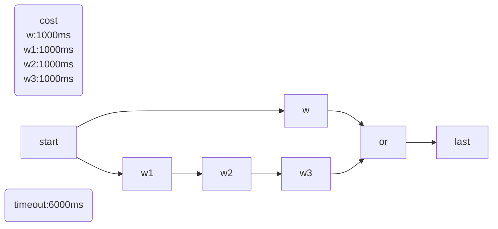
::: details
```java
public class Demo10 {

    /**
     * w1 -> w2 -> w3
     *            ---  last
     * w
     * w1和w并行，w执行完后就执行last，此时b、c还没开始，b、c就不需要执行了
     */
    public static void main(String[] args) throws ExecutionException, InterruptedException {
        ParWorker1 w1 = new ParWorker1();
        //注意这里，如果w1的执行时间比w长，那么w2和w3肯定不走。 如果w1和w执行时间一样长，多运行几次，会发现w2有时走有时不走
//        w1.setSleepTime(1100);

        ParWorker w = new ParWorker();
        ParWorker2 w2 = new ParWorker2();
        ParWorker3 w3 = new ParWorker3();
        ParWorker4 w4 = new ParWorker4();

        WorkerWrapper<String, String> last =  new WorkerWrapper.Builder<String, String>()
                .worker(w1)
                .callback(w1)
                .param("last")
                .build();

        WorkerWrapper<String, String> wrapperW =  new WorkerWrapper.Builder<String, String>()
                .worker(w)
                .callback(w)
                .param("w")
                .next(last, false)
                .build();

        WorkerWrapper<String, String> wrapperW3 =  new WorkerWrapper.Builder<String, String>()
                .worker(w3)
                .callback(w3)
                .param("w3")
                .next(last, false)
                .build();

        WorkerWrapper<String, String> wrapperW2 =  new WorkerWrapper.Builder<String, String>()
                .worker(w2)
                .callback(w2)
                .param("w2")
                .next(wrapperW3)
                .build();

        WorkerWrapper<String, String> wrapperW1 =  new WorkerWrapper.Builder<String, String>()
                .worker(w1)
                .callback(w1)
                .param("w1")
                .next(wrapperW2)
                .build();

        Async.beginWork(6000, wrapperW, wrapperW1);
        Async.shutDown();
    }
}

```
:::
反转代码：
::: details
```java
public class Demo10R {

    /**
     * w1 -> w2 -> w3
     *            ---  last
     * w
     * w1和w并行，w执行完后就执行last，此时b、c还没开始，b、c就不需要执行了
     */
    public static void main(String[] args) throws ExecutionException, InterruptedException {
        ParWorker1 w1 = new ParWorker1();
        //注意这里，如果w1的执行时间比w长，那么w2和w3肯定不走。 如果w1和w执行时间一样长，多运行几次，会发现w2有时走有时不走
//        w1.setSleepTime(1100);

        ParWorker w = new ParWorker();
        ParWorker2 w2 = new ParWorker2();
        ParWorker3 w3 = new ParWorker3();
        ParWorker4 w4 = new ParWorker4();

        WorkerWrapper<String, String> wrapperW1 =  new WorkerWrapper.Builder<String, String>()
                .worker(w1)
                .callback(w1)
                .param("w1")
                .build();

        WorkerWrapper<String, String> wrapperW =  new WorkerWrapper.Builder<String, String>()
                .worker(w)
                .callback(w)
                .param("w")
                .build();

        WorkerWrapper<String, String> last =  new WorkerWrapper.Builder<String, String>()
                .worker(w1)
                .callback(w1)
                .param("last")
                .depend(wrapperW)
                .build();

        WorkerWrapper<String, String> wrapperW2 =  new WorkerWrapper.Builder<String, String>()
                .worker(w2)
                .callback(w2)
                .param("w2")
                .depend(wrapperW1)
                .build();

        WorkerWrapper<String, String> wrapperW3 =  new WorkerWrapper.Builder<String, String>()
                .worker(w3)
                .callback(w3)
                .param("w3")
                .depend(wrapperW2)
                .next(last, false)
                .build();

        Async.beginWork(6000,Executors.newCachedThreadPool(),  wrapperW, wrapperW1);

    }
}

```
:::


## 源码研究

### 运行

WorkerWrapper方法：

1. 检查remainTime，如果小于等于0，快速失败，把自身状态设置为INIT，开始下一个work，终止当前方法
2. 检查自身状态state，如果为FINISH或者ERROR，表示已经执行过了，开始下一个work，终止当前方法
3. 如果needCheckNextWrapperResult为true且自身的next work已经开始执行或者有结果了，把自身state设置为INIT，开始下一个work，终止当前方法
4. 检查自身 dependWrappers，如果没有依赖，执行自身，然后执行下一个，终止当前方法
5. 检查自身 dependWrappers，如果为1，执行依赖job，执行下一个Job，终止当前方法
6. 检查自身 dependWrappers，如果有多个依赖，执行依赖job


ps：感觉参考中博客解析已经足够详细

### 代码

任务运行起点是 Async 类的beginWork方法，异步执行所有 wrapper#work方法，使用 CompletableFuture#allOf控制所有任务总超时时间

```java
        //保存线程池变量
        Async.executorService = executorService;
        //定义一个map，存放所有的wrapper，key为wrapper的唯一id，value是该wrapper，可以从value中获取wrapper的result
        Map<String, WorkerWrapper> forParamUseWrappers = new ConcurrentHashMap<>();
        CompletableFuture[] futures = new CompletableFuture[workerWrappers.size()];
        for (int i = 0; i < workerWrappers.size(); i++) {
            WorkerWrapper wrapper = workerWrappers.get(i);
            futures[i] = CompletableFuture.runAsync(() -> wrapper.work(executorService, timeout, forParamUseWrappers), executorService);
        }
        try {
            CompletableFuture.allOf(futures).get(timeout, TimeUnit.MILLISECONDS);
            return true;
        } catch (TimeoutException e) {
            Set<WorkerWrapper> set = new HashSet<>();
            totalWorkers(workerWrappers, set);
            for (WorkerWrapper wrapper : set) {
                wrapper.stopNow();
            }
            return false;
        }
```

看wrapper逻辑前，看一下wrapper属性

```java
public class WorkerWrapper<T, V> {
    /**
     * 该wrapper的唯一标识
     */
    private String id;
    /**
     * worker将来要处理的param【入参】
     */
    private T param;
    private IWorker<T, V> worker;
    private ICallback<T, V> callback;
    /**
     * 在自己后面的wrapper，如果没有，自己就是末尾；如果有一个，就是串行；如果有多个，有几个就需要开几个线程</p>
     * -------2
     * 1
     * -------3
     * 如1后面有2、3
     */
    private List<WorkerWrapper<?, ?>> nextWrappers;
    /**
     * 依赖的wrappers，有2种情况，1:必须依赖的全部完成后，才能执行自己 2:依赖的任何一个、多个完成了，就可以执行自己
     * 通过must字段来控制是否依赖项必须完成
     * 1
     * -------3
     * 2
     * 1、2执行完毕后才能执行3
     */
    private List<DependWrapper> dependWrappers;
    /**
     * 标记该事件是否已经被处理过了，譬如已经超时返回false了，后续rpc又收到返回值了，则不再二次回调
     * 经试验,volatile并不能保证"同一毫秒"内,多线程对该值的修改和拉取
     * <p>
     * 1-finish, 2-error, 3-working
     */
    private AtomicInteger state = new AtomicInteger(0);
    /**
     * 该map存放所有wrapper的id和wrapper映射
     */
    private Map<String, WorkerWrapper> forParamUseWrappers;
    /**
     * 也是个钩子变量，用来存临时的结果
     */
    private volatile WorkResult<V> workResult = WorkResult.defaultResult();
    /**
     * 是否在执行自己前，去校验nextWrapper的执行结果<p>
     * 1   4
     * -------3
     * 2
     * 如这种在4执行前，可能3已经执行完毕了（被2执行完后触发的），那么4就没必要执行了。
     * 注意，该属性仅在nextWrapper数量<=1时有效，>1时的情况是不存在的
     */
    private volatile boolean needCheckNextWrapperResult = true;

    private static final int FINISH = 1;
    private static final int ERROR = 2;
    private static final int WORKING = 3;
    private static final int INIT = 0;
    
}
```

看一下 wrapper 的 work，beginNext方法

```java
    /**
     * 开始工作
     * fromWrapper代表这次work是由哪个上游wrapper发起的
     */
    private void work(ExecutorService executorService, WorkerWrapper fromWrapper, long remainTime, Map<String, WorkerWrapper> forParamUseWrappers) {
        this.forParamUseWrappers = forParamUseWrappers;
        //将自己放到所有wrapper的集合里去
        forParamUseWrappers.put(id, this);
        long now = SystemClock.now();
        //总的已经超时了，就快速失败，进行下一个
        if (remainTime <= 0) {
            fastFail(INIT, null);
            beginNext(executorService, now, remainTime);
            return;
        }
        //如果自己已经执行过了。
        //可能有多个依赖，其中的一个依赖已经执行完了，并且自己也已开始执行或执行完毕。当另一个依赖执行完毕，又进来该方法时，就不重复处理了
        if (getState() == FINISH || getState() == ERROR) {
            beginNext(executorService, now, remainTime);
            return;
        }

        //如果在执行前需要校验nextWrapper的状态
        if (needCheckNextWrapperResult) {
            //如果自己的next链上有已经出结果或已经开始执行的任务了，自己就不用继续了
            if (!checkNextWrapperResult()) {
                fastFail(INIT, new SkippedException());
                beginNext(executorService, now, remainTime);
                return;
            }
        }

        //如果没有任何依赖，说明自己就是第一批要执行的
        if (dependWrappers == null || dependWrappers.size() == 0) {
            fire();
            beginNext(executorService, now, remainTime);
            return;
        }

        /*如果有前方依赖，存在两种情况
         一种是前面只有一个wrapper。即 A  ->  B
        一种是前面有多个wrapper。A C D ->   B。需要A、C、D都完成了才能轮到B。但是无论是A执行完，还是C执行完，都会去唤醒B。
        所以需要B来做判断，必须A、C、D都完成，自己才能执行 */

        //只有一个依赖
        if (dependWrappers.size() == 1) {
            doDependsOneJob(fromWrapper);
            beginNext(executorService, now, remainTime);
        } else {
            //有多个依赖时
            doDependsJobs(executorService, dependWrappers, fromWrapper, now, remainTime);
        }

    }
```


```java
    /**
     * 进行下一个任务
     */
    private void beginNext(ExecutorService executorService, long now, long remainTime) {
        //花费的时间
        long costTime = SystemClock.now() - now;
        if (nextWrappers == null) {
            return;
        }
        if (nextWrappers.size() == 1) {
            nextWrappers.get(0).work(executorService, WorkerWrapper.this, remainTime - costTime, forParamUseWrappers);
            return;
        }
        CompletableFuture[] futures = new CompletableFuture[nextWrappers.size()];
        for (int i = 0; i < nextWrappers.size(); i++) {
            int finalI = i;
            futures[i] = CompletableFuture.runAsync(() -> nextWrappers.get(finalI)
                    .work(executorService, WorkerWrapper.this, remainTime - costTime, forParamUseWrappers), executorService);
        }
        try {
            CompletableFuture.allOf(futures).get(remainTime - costTime, TimeUnit.MILLISECONDS);
        } catch (Exception e) {
            e.printStackTrace();
        }
    }
```

## 个人观点

这个框架是以最终目的task是否执行为导向的，只要最终task被执行，也就无所谓其他task是否执行。

感觉最可取的地方是代码少却足以覆盖绝大部分场景

不足的地方：

1. 分析源码可知，task之间的依赖是编写每个执行单元时设置的，可以设置执行单元的前驱和后继，build的时，会调用前驱执行单元的addNext方法，调用后继执行单元的addDepend方法。

   实际上一般这种任务编排都是有向无环图（DAG），个人认为应该划分出一个新类用于编排执行单元执行顺序，而不是把流程控制放在每个执行单元中。这个类可以采用图的数据结构形式，点表示执行单元，边表示依赖关系，流程会更加清晰。

2. 基本需要使用 newCacheThreadPool，用无界线程池保证；线程有限时，如果某个执行单元长时间占用线程，且线程不足时，很容易失败。

3. 潜在并发问题（2023.10.21未修改）

   详细见[依赖上游的执行结果作为入参->存在并发问题 · Issue #I5QM0O · 京东零售/asyncTool - Gitee.com](https://gitee.com/jd-platform-opensource/asyncTool/issues/I5QM0O?from=project-issue)

   推测一种触发方式如下，如果a执行完毕，设置自身状态为FINISH，a还没设置结果，也没未触发回调。如果弱依赖b触发了c，c发现强依赖a完成了，开始执行c，c把a的结果作为入参，发现还未就绪。

   ```mermaid
   graph LR
   a-->c
   b-.触发.->c
   ```

   

   原因是采用无锁结构，且不用图结构编排执行顺序，但不能保证设置执行单元状态，执行结果等被同时原子设置

## 参考

[asyncTool: 解决任意的多线程并行、串行、阻塞、依赖、回调的并行框架，可以任意组合各线程的执行顺序，带全链路执行结果回调。多线程编排一站式解决方案。来自于京东主App后台。 (gitee.com)](https://gitee.com/jd-platform-opensource/asyncTool)

[3、AsyncTool框架原理源码解析_async.beginwork-CSDN博客](https://blog.csdn.net/rongtaoup/article/details/125247310)