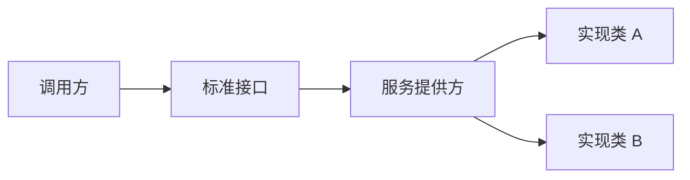

## 简介

SPI(Service Provider Interface) 是 Java 提供的一种服务发现机制，主要作用是实现软件组件的扩展和替换，常用于实现插件机制



## ServiceLoader

Java JDK 默认提供的 ServiceLoader 类提供加载服务实现

```java
        ServiceLoader<MessageService> messageServices = ServiceLoader.load(MessageService.class);
        for(MessageService messageService:messageServices){
            messageService.sendMessage("hello");
        }
```

服务加载类

```java
    /**
     * 创建一个指定类型的服务加载器
     * @param  <S> 服务 class 类
     *
     * @param  service 服务接口或者抽象类
     *         
     * @param  loader 加载服务提供者配置文件的 ClassLoader, 如果为 null 时会被设置为 system ClassLoader
     *
     * @return 新的 service loader
     */
    public static <S> ServiceLoader<S> load(Class<S> service,
                                            ClassLoader loader)
    {
        return new ServiceLoader<>(service, loader);
    }

	/**
	* 线程的上下文加载器默认为系统加载器
    */
    public static <S> ServiceLoader<S> load(Class<S> service) {
        ClassLoader cl = Thread.currentThread().getContextClassLoader();
        return ServiceLoader.load(service, cl);
    }

    /**
     * 清除此类加载器的提供者缓存, 以便所有提供者将被重新加载
     *
     * 在调用此方法后, 后续调用 {@link #iterator()} 迭代器方法将重新懒加载和实例化提供者, 就像一个新创建的加载器一样
     *
     * 此方法用于在新的服务提供者可以安装到运行的 Java 虚拟机中的情况下
     */
    public void reload() {
        providers.clear();
        lookupIterator = new LazyIterator(service, loader);
    }

    /**
     * 使用扩展类加载器为给定的服务类型创建一个新的服务加载器
     *
     * 如果找不到扩展类加载器，使用系统类加载器
     * 该方法当仅需要已被加载的提供者时，此方法很有用。该方法将仅查找和加载已安装到当前 Java 虚拟机中的提供者
     * 应用程序类路径上的服务提供者将被忽略
     *
     * @param  <S> the class of the service type
     *
     * @param  service 服务的接口或抽象类
     *
     * @return A new 新的服务加载器
     */
    public static <S> ServiceLoader<S> loadInstalled(Class<S> service) {
        ClassLoader cl = ClassLoader.getSystemClassLoader();
        ClassLoader prev = null;
        while (cl != null) {
            prev = cl;
            cl = cl.getParent();
        }
        return ServiceLoader.load(service, prev);
    }
```

ServiceLoader 使用的是懒加载的方式，但是加载会遍历所有实现类，所有实现类会被实例化一遍。每次调用 load 方法，都会生成新的实例

源码实现思路：输入类全限定名，扫描类路径文件 `META-INF/services/ 全限定名 ` 这个文件，按行读取，每行是一个实现类的全限定名，通过反射实例化

## 参考

[浅析 Java - SPI 机制 | 京东云技术团队 - 掘金 (juejin.cn)](https://juejin.cn/post/7272732548790452236?searchId=2023090709203249EFF0B9F6A6CDFAEE09)