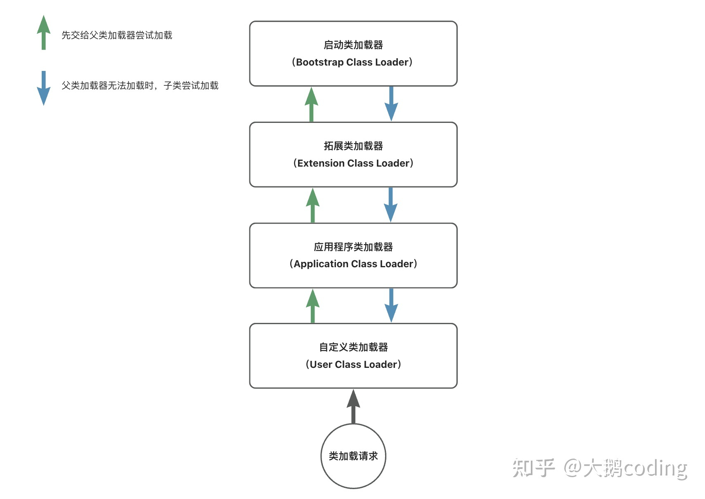

## 简介

Java 类加载器 (ClassLoader) 是负责加载类的子系统, 主要有以下几个方面的作用:

1. 类加载 - 根据一个指定的类名称找到类的二进制数据, 并从这些数据中构造一个 Class 对象。
2. 类链接 - 将类的二进制数据验证、准备并解析为方法区中的运行时数据结构。
3. 类初始化 - 调用类构造器 `<clinit>()` 方法对类进行初始化。

Java 提供了三个主要的类加载器:

1. 引导类加载器 (Bootstrap ClassLoader)- 加载 Java 核心库 (JRE 的 rt.jar), 由 C++ 实现。
2. 扩展类加载器 (Extensions ClassLoader) - 加载 JRE 的扩展库 (`javax.*`), 由 Java 实现。
3. 系统类加载器 (System ClassLoader)- 加载 CLASSPATH 路径下的类, 是最常用的加载器。

## 双亲委托模型

双亲委托模型是 Java 类加载器默认实现的，如果重写相关加载方法可以破坏该模型。

使用双亲委托模型可以防止核心类被恶意重新加载

## 参考

[Java 类加载机制 - 知乎 (zhihu.com)](https://zhuanlan.zhihu.com/p/25228545)