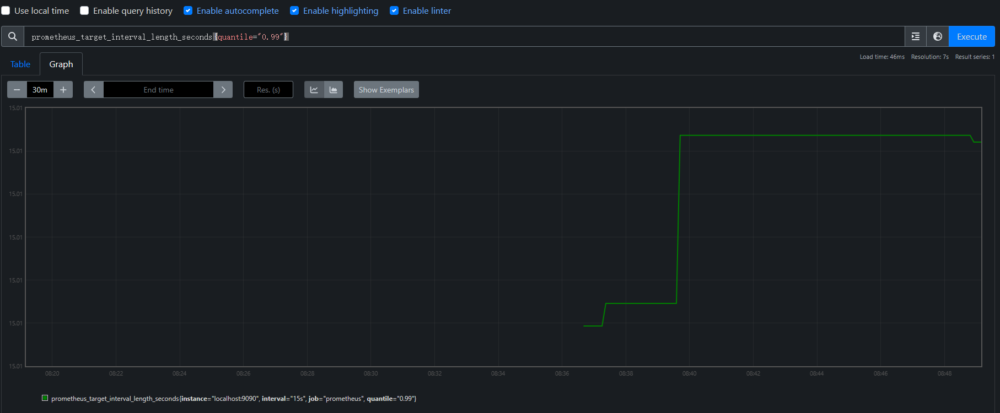
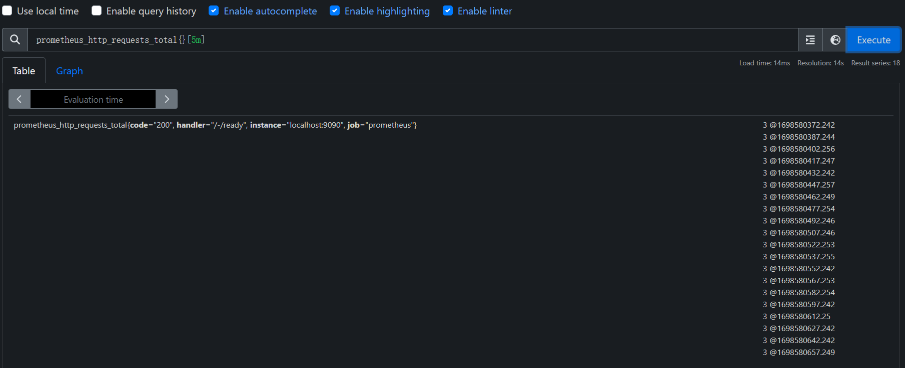

## 简介

prometheus 是一个开源监控系统，基于时序数据库（Time Series Database），有如下特点：

+ 不依赖分布式存储; 单个服务器节点是自治的
+ 支持 HTTP 的拉取 (pull) 方式收集时间序列数据
+ 通过服务发现或静态配置 2 种方式发现目标
+ 支持多种可视化和仪表盘，如 grafana

prometheus 非常适合记录任何 ** 纯数字时间序列 **。它适合以机器为中心的监控以及高动态监控面向服务的体系结构。在微服务世界中，它支持多维度数据收集和查询，这是它的强项。

每个 prometheus server 是独立的，不依赖于网络存储或其他远程服务。 当基础架构的其他部分损坏时，可以依赖它，并且无需安装额外的基础设施即可使用它。

prometheus 主要提供统计信息，提供监控功能，不适合需要 100% 数据准确的场景，例如不适合请求计费，因为收集的数据不够完整和详细

## 核心组件

+ Prometheus Server

  主要用于抓取数据和存储时序数据, 另外还提供查询和 Alert Rule 配置管理。

+ client libraries

  用于检测应用程序代码的客户端库。

+ push gateway

  用于批量，短期的监控数据的汇总，主要用于业务数据汇报等。

+ exporters

  收集监控样本数据，并以标准格式向 Prometheus 提供。例如: 收集服务器系统数据的 node_exporter，收 MysQL 监控样本数据的是
  MysqlExporter 等等。

+ alertmanage
  用于告警通知管理的。

## 架构


## 概念和规范

### 数据模型

Prometheus 所有采集的监控数据均以指标（metric）的形式保存在内置的时间序列数据库中（TSDB）。除了存储的时间序列，Prometheus
还可以根据查询请求产生临时的时间序列作为返回结果。

#### metric 和 label

每条 time series 由 metric name 以及一组可选的 label （key-value pair）唯一标识

**Metric names:**

metric name 只能由 ASCII 字符、数字、下划线以及冒号组成，满足正则表达式 `[a-zA-Z_:][a-zA-Z0-9_:]*`

注意：冒号用来表示用户自定义规则，不能在 exporter 或者监控对象暴露的 metric 中直接使用

**Metric labels:**

label 其实就是一对 key-value，用于过滤和聚合。

label 的 key 只能由 ASCII 字符、数字以及下划线组成，其中以 `__`（两下划线）作为前缀的标签都是系统保留的关键字，只能在系统内部使用。

label 的 value 可以是任意 Unicode 编码的字符

#### Samples

samples 由时序数据构成，每一个 sample（采样值）包括：

+ float64 类型的 value
+ 毫秒级时间戳

注意：从 v2.40 开始，开始实验性对 histograms 支持，sample 可以使用 full histogram value

#### Notation

一般可以使用如下 metric name 和 labels 集合的 notation（表达式）来表示时间序列（time series）

```
<metric name>{<label name>=<label value>, ...}
```

例如，可以用下面表达式表示，metric name 为 `api_http_requests_total`，label 为 `method="POST"` 和 label
为 `handler="/messages"` 的时间序列

```
api_http_requests_total{method="POST", handler="/messages"}
```

这也是 [OpenTSDB](http://opentsdb.net/) 标准

### Metric 类型

主要类型如下：

#### Counter

Counter（计数器）是值单调递增的 metric，除非监控系统发生重置，否则只增不减。

常用于：

+ 服务的请求数
+ 已完成的任务数
+ 错误发生的次数

Counter 通过计算后，可以用于表示变化率，PromQL 提供一些如 `rate`、`irate` 函数用于相关计算

#### Gauge

Gauge （仪表盘）是值可以任意变化的 metric。

常用于：

+ 温度
+ 内存使用率
+ 当前并发请求的数量

#### Histogram

Histogram（直方图）是提供区间筛选功能，以解决数据取平均长尾问题。

Histogram 在一段时间范围内对数据进行采样（通常是请求持续时间或响应大小等），并将其计入可配置的存储桶（bucket）中，后续可通过指定区间筛选样本，也可以统计样本总数。

一个 metric name 为 `<basename>` 的 histogram 被抓取时应该提供以下几种数据：

+ 各个 bucket 计数和

  `<basename>_bucket{le="<upper inclusive bound>"}`

+ 值的总和

  `<basename>_sum`

+ 全部值计数和

  `<basename>_count`，这个值应该和 `<basename>_bucket{le="+Inf"}` 相等

使用 histogram_quantile() 函数从直方图或者直方图的聚合中计算分位数。直方图也适用于计算 Apdex score。在对桶进行操作时，请记住直方图的值是累积的。

注意：Prometheus v2.40 后实验性的支持 native histogram，native histogram 只需要一个时间序列就可以表示直方图，而不再需要上面几种数据。可以以更高的成本提供更高的分辨率的数据

#### Summary

Summary（摘要）常用于表示一段时间内的 samples 计算结果，值直接表示分位数，而不需要通过区间计算。

一个 metric name 为 `<basename>` 的 summary 被抓取时应该提供以下几种数据：

+ 分位值

  `<basename>{quantile=<φ>}`，其中 `0<=φ<=1`

  ```
    // http 请求中有 50% 的请求响应时间是 3.052404983s
  io_namespace_http_requests_latency_seconds_summary{path="/",method="GET",code="200",quantile="0.5",} 3.052404983
    
    //  http 请求中有 90% 的请求响应时间是 8.003261666s
  io_namespace_http_requests_latency_seconds_summary{path="/",method="GET",code="200",quantile="0.9",} 8.003261666
  ```

+ 值的总和

  `<basename>_sum`

+ 全部值计数和

  `<basename>_count`

### JOBS 和 INSTANCES

instance：一个被抓取的 endpoint 为一个 instance

job：具有相同用途的 instance 集合为一个 job

For example, an API server job with four replicated instances:

例如，一个叫 api-server 的 job，抓取四个 instance 的数据

- instance 1: `1.2.3.4:5670`
- instance 2: `1.2.3.4:5671`
- instance 3: `5.6.7.8:5670`
- instance 4: `5.6.7.8:5671`

#### 自动生成的 label 和时间序列

当 Prometheus 抓取目标时，它会自动将一些标签附加到被抓取目标的时间序列，用于识别被抓取目标：

- `job`：目标所属的已配置作业名称。
- `instance`：抓取目标 URL 中 `<host>:<port>`

如果上面 label 在被抓取数据中已经存在了，会根据 `honor_labels` 配置选项决定怎么设置这些
label，见到 [scrape configuration documentation](https://prometheus.io/docs/prometheus/latest/configuration/configuration/#scrape_config)

对于每个被抓取的 instance，Prometheus 保存着以下 sample 的时间序列:

- `up{job="<job-name>", instance="<instance-id>"}`

  值为 `1` 如果 instance 是健康的（可达的）. 或者为 `0` 如果抓取失败

- `scrape_duration_seconds{job="<job-name>", instance="<instance-id>"}`

  值为抓取的周期

- `scrape_samples_post_metric_relabeling{job="<job-name>", instance="<instance-id>"}`

  值为被重新 label 后剩余的 samples 数

- `scrape_samples_scraped{job="<job-name>", instance="<instance-id>"}`

  值为被抓取目标提供的 samples 数

- `scrape_series_added{job="<job-name>", instance="<instance-id>"}`

  值为本次抓取中新序列的大致数量 *New in v2.10*

`up` 这个时间序列对实例可到达性监控很有用

## 快速开始

### 下载运行

可以在官方下载二进制文件或者以 docker 的方式启动：[下载 | 普罗 米修斯 (prometheus.io)](https://prometheus.io/download/)

二进制文件可以直接运行，运行后监听 9090 端口

### 配置 Prometheus 以监控自身

参考下 prometheus 配置文件 prometheus.yml，配置了一个 `prometheus` 的 job，抓取目标为 `localhost:9090`，也就是自身数据

```yaml
scrape_configs:
  # The job name is added as a label `job=<job_name>` to any timeseries scraped from this config.
  - job_name: "prometheus"

    # metrics_path defaults to '/metrics'
    # scheme defaults to 'http'.

    static_configs:
      - targets: ["localhost:9090"]
```

### 启动 Prometheus

要是新配置文件，需要重新启动 prometheus，如果使用的默认配置文件，需要指定使用的配置文件

```sh
# Start Prometheus.
# By default, Prometheus stores its database in ./data (flag --storage.tsdb.path).
./prometheus --config.file=prometheus.yml
```

打开 http://localhost:9090/metrics，可以看到自身相关 metrics

### Web UI

打开 http://localhost:9090/graph 可以输入 PromQL 语句进行数据可视化

如下是获取 prometheus job 抓取的实际周期

```
prometheus_target_interval_length_seconds{quantile="0.99"}
```



### 给抓取目标打上 label

修改 `prometheus.yml` 实现抓取指定目标时，打上指定 label

如下修改，抓取 `localhost:8080` 和 `localhost:8081` 会打上 `group=production` 这个 label

```yaml
scrape_configs:
  - job_name:       'node'

    # Override the global default and scrape targets from this job every 5 seconds.
    scrape_interval: 5s

    static_configs:
      - targets: ['localhost:8080', 'localhost:8081']
        labels:
          group: 'production'

      - targets: ['localhost:8082']
        labels:
          group: 'canary'
```

### 配置数据聚合规则

直接使用表达式进行临时查询会对当前已有时间序列进行聚合计算，如果计算复杂，可能会比较慢，为了提高效率，可以预先配置表达式，这样就能预先生成新的持久化时间序列

新建一个 prometheus.rules.yml 文件，配置了一个新的 metrics 为 `job_instance_mode:node_cpu_seconds:avg_rate5m`
，使用的表达式为 ` avg by (job, instance, mode) (rate(node_cpu_seconds_total[5m]))`

```yaml
groups:
- name: cpu-node
  rules:
  - record: job_instance_mode:node_cpu_seconds:avg_rate5m
    expr: avg by (job, instance, mode) (rate(node_cpu_seconds_total[5m]))
```

修改 prometheus.yml，添加规则配置文件，注意 `rule_files` 字段

```yaml
global:
  scrape_interval:     15s # By default, scrape targets every 15 seconds.
  evaluation_interval: 15s # Evaluate rules every 15 seconds.

  # Attach these extra labels to all timeseries collected by this Prometheus instance.
  external_labels:
    monitor: 'codelab-monitor'

rule_files:
  - 'prometheus.rules.yml'

scrape_configs:
  - job_name: 'prometheus'

    # Override the global default and scrape targets from this job every 5 seconds.
    scrape_interval: 5s

    static_configs:
      - targets: ['localhost:9090']
```

现在可以直接使用下面方式查询，而不是语句

```
job_instance_mode:node_cpu_seconds:avg_rate5m
```

### 运行时重载配置

可以使用下面命令在运行时重载配置，如果配置文件出错，则不会重载

1. 使用 `SIGHUP` 向 prometheus 进程发送信号
2. 使用 POST 方法请求 `/-/reload` 接口（需要启动时使用 `--web.enable-lifecycle` 标志 ）

## 查询

Prometheus 的查询语句叫 PromQL，在 WebUI 中表达式结果可以展示为图表或表格数据，外部系统也可以通过 HTTP API 获取表格数据

### 表达式语言数据类型

PromQL 表达式计算结果为以下几种类型：

+ 瞬时向量（Instant vector）

  一组时间序列，每个时间序列包含一个 sample，所有 sample 有相同的时间戳

+ 范围向量（Range vector）

  一组时间序列，每个时间时序包含一定范围内的 sample 数据

+ 标量（Scalar）

  一个 floating 类型数据值

+ 字符串（String）

  字符串类型数据值，当前该类型不会使用

目前瞬时向量是唯一可以直接绘制图形的类型

### 字面量（Literals）

#### String 字面量

字符串可以用单引号、双引号、反引号指定文字常量。

PromQL 大部分情况遵循 [Go 的转义规则](https://go.dev/ref/spec#String_literals)：

1. 使用单引号或双引号时，用反斜杠表示转义
2. 特殊字符可以用八进制 `\nnn` 或者十六进制 `\xnn`、`\unnnn`、`\Unnnnnnnn`
3. 与 Go 不同，Prometheus 不会转义反引号内的换行符

例如

```
"this is a string"
'these are unescaped: \n \\ \t'
`these are not unescaped: \n ' " \t`
```

#### float 字面量

标量浮点值可以写成文字整数或浮点数，格式如下（仅包含空格以提高可读性）:

```
[-+]?(
      [0-9]*\.?[0-9]+([eE][-+]?[0-9]+)?
    | 0[xX][0-9a-fA-F]+
    | [nN][aA][nN]
    | [iI][nN][fF]
)
```

例如

```
23
-2.43
3.4e-9
0x8f
-Inf
NaN
```

### 时间序列选择

#### 瞬时向量选择器

选择 metrics name 为 `http_requests_total` ，label `job` 为 `prometheus`,label `group` 为 `canary` 的瞬时向量

```
http_requests_total{job="prometheus",group="canary"}
```

#### 范围向量选择器

选择五分钟内，metrics name 为 prometheus_http_requests_total 的 samples

```
prometheus_http_requests_total{}[5m]
```



### 语法

#### 标签选择

标签选择器支持以下运算符：

- `=`：选择与提供的字符串完全相等的标签。
- `!=`：选择不等于提供的字符串的标签。
- `=~`：选择与提供的字符串进行正则表达式匹配的标签。
- `!~`：选择与提供的字符串不匹配的标签。

正则前后是固定的，例如表达式 `env=~"foo"` 会被视为 `env=~"^foo$"`

例子：

匹配 environment 为 `staging` 或 `testing` 或 `development`，企鹅 method 不为 `GET` 的

```
http_requests_total{environment=~"staging|testing|development",method!="GET"}
```

没有指定时间序列，会对所有时间序列进行匹配

```
{job="prometheus"}
```

同一个 label，可以使用多个匹配器。例如下面匹配 metrics name 以 `net` 开头，且不包含 `failed` 的时间序列

```
{__name__=~"net.*?",__name__!~".*?failed.*?"}
```

Prometheus 正则语法使用 [RE2 语法](https://github.com/google/re2/wiki/Syntax)

#### 时间跨度（Time Durations）

时间跨度跨度用数字加上一个字母表示

时间单位参考如下：

- `ms`

  毫秒

- `s`

  秒

- `m`

  分钟

- `h`

  小时

- `d`

  天，假设一天总是 24 小时

- `w`

  周，假设一周始终为 7 天

- `y`

  年，假设一年总是 365 天

时间可以串连表示更精确的时间，单位必须从大到小，且每个单位只能出现一次，例如 `1h30m`

#### offset 修饰符（Offset modifier）

时间偏移修饰符为 `offset`，用于从现在开始向前偏移一定时间数据，能够作用于单个瞬时向量或范围向量，例如

```
prometheus_http_requests_total offset 5m
prometheus_http_requests_total{}[5m] offset 5m
```

如果需要向后偏移，可以使用负偏移值

```
prometheus_http_requests_total offset -5m
```

#### @ 修饰符

@ 修饰符用于获取指定时间戳的数据，时间戳使用 UNIX 时间戳，能够作用于单个瞬时向量或者范围向量

```
prometheus_http_requests_total @1698581317
prometheus_http_requests_total @1698581317.242
```

可以和 offset 关键字一起使用，两者顺序不影响结果，都是从 @ 指定的时间开始计算 offset

```
# offset after @
prometheus_http_requests_total @ 1609746000 offset 5m
# offset before @
prometheus_http_requests_total offset 5m @ 1609746000
```

@可以和 start()以及 end() 一起使用

#### 子查询

子查询语法

```
<instant_query> '[' <range> ':' [<resolution>] ']' [@ <float_literal>] [offset <duration>]
```

- `<resolution>` 是可选的. 默认为全局评估间隔

这部分没看懂，官网也没给例子...

#### 注释

注释以 `#` 开始

```
# 这是注释
```

### 运算

#### 算数运算

支持以下算术符 （op）:

- `+` (加法)
- `-` (减法)
- `*` (乘法)
- `/` (除法)
- `%` (求余)
- `^` (幂)

算术运算可以应用于 ` 标量 op 标量 ` 、` 向量 op 标量 `、` 向量 op 向量 `

两个瞬时向量之间运算是对于每个左边的向量和它匹配（默认匹配方式为各个 label 完全一致）的右边向量作一次运算，运算结果也为向量，结果向量没有
metrics name

#### 三角运算

Prometheus 中存在以下三角二元运算符，以弧度为单位工作：

- `atan2`（基于 https://pkg.go.dev/math#Atan2)

#### 比较运算符

Prometheus 中支持以下比较运算符：

- `==`（相等）
- `!=`（不相等）
- `>`（大于）
- `<`（小于）
- `>=`（大于或等于）
- `<=`（小于或等于）

两个标量之间运算需要使用 `bool` 关键字，结果为 0 或 1

```
2 > bool 1 # 结果为 1
```

瞬时向量和标量之间运算如果不用 `bool`
关键字，表示对结果的筛选，不满足筛选条件的数据会被抛弃，结果值仍为原始值。如果使用 `bool`
关键字，不会抛弃数据，结果值如果满足筛选条件，结果值为 `1`，如果不满足，结果值为 `0`

```
prometheus_http_requests_total > bool 1
prometheus_http_requests_total > 1
```

瞬时向量和瞬时向量之间运算也是匹配运算，用不用关键字 `bool` 结果参考上面的瞬时向量和标量之间运算

#### 集合运算符

+ and
+ or
+ unless（排除）

**vector1 and vector2** 会产生一个由 `vector1` 的元素组成的新的向量。该向量包含 vector1 中完全匹配 `vector2` 中的元素组成。

**vector1 or vector2** 会产生一个新的向量，该向量包含 `vector1` 中所有的 sample 数据，以及 `vector2` 中没有与 `vector1`
匹配到的 sample 数据。

**vector1 unless vector2** 会产生一个新的向量，新向量中的元素由 `vector1` 中没有与 `vector2` 匹配的元素组成。

#### 匹配模式

向量与向量之间进行运算操作，会基于默认规则进行匹配：选择与左边向量标签完全一致的右边向量，如果匹配失败，则直接丢弃。

PromQL 中有下面几种匹配模式：

+ 一对一
+ 多对一
+ 一对多

##### 一对一

一对一匹配是默认的匹配模式，一对一匹配会匹配 op 两边标签完全一致的 sample

```
vector1 <operator> vector2
```

如果两边标签不一致，可以使用 `on(label list)` 和 `ignoring(label list)` 来指定匹配行为

`on` 可以指定用于匹配的标签

```
<vector expr> <bin-op> on(<label list>) <vector expr>
```

`ignoreing` 可以指定匹配时，忽略的标签

```
<vector expr> <bin-op> ignoring(<label list>) <vector expr>
```

例如输入：

```
method_code:http_errors:rate5m{method="get", code="500"}  24
method_code:http_errors:rate5m{method="get", code="404"}  30
method_code:http_errors:rate5m{method="put", code="501"}  3
method_code:http_errors:rate5m{method="post", code="500"} 6
method_code:http_errors:rate5m{method="post", code="404"} 21

method:http_requests:rate5m{method="get"}  600
method:http_requests:rate5m{method="del"}  34
method:http_requests:rate5m{method="post"} 120
```

查询如下：

```
method_code:http_errors:rate5m{code="500"} / ignoring(code) method:http_requests:rate5m
```

结果如下：

```
{method="get"}  0.04            //  24 / 600
{method="post"} 0.05            //   6 / 120
```

##### 多对一和一对多

这种情况是，一侧的向量可以和另一个的多个向量匹配

```
<vector expr> <bin-op> ignoring(<label list>) group_left(<label list>) <vector expr>

<vector expr> <bin-op> ignoring(<label list>) group_right(<label list>) <vector expr>

<vector expr> <bin-op> on(<label list>) group_left(<label list>) <vector expr>

<vector expr> <bin-op> on(<label list>) group_right(<label list>) <vector expr>
```

group 修饰符的 left 和 right 一般会指向基数更多的一侧

例如：

```
method_code:http_errors:rate5m / ignoring(code) group_left method:http_requests:rate5m
```

```
{method="get", code="500"}  0.04            //  24 / 600
{method="get", code="404"}  0.05            //  30 / 600
{method="post", code="500"} 0.05            //   6 / 120
{method="post", code="404"} 0.175           //  21 / 120
```

左向量有 method 和 code 两个 label，右向量有 method 一个 label

#### 聚合运算

Prometheus 提供了下列内置的聚合操作符，这些操作符用于瞬时向量。可以将瞬时表达式返回的 samples 数据进行聚合，形成一个具有较少
samples 新的时间序列。

+ `sum` (求和)

+ `min` (最小值)

+ `max` (最大值)

+ `avg` (平均值)

+ `stddev` (标准差)

+ `stdvar` (标准差异)

+ `count` (计数)

+ `count_values` (对 value 进行计数)

+ `bottomk` (样本值最小的 k 个元素)

+ `topk` (样本值最大的 k 个元素)

+ `quantile` (分布统计)

语法如下：

```
<aggr-op>([parameter,] <vector expression>)[without|by (<label list>)]
```

其中只有 `count_values`, `quantile`, `topk`, `bottomk` 支持参数 (parameter)。

`without` 用于从计算结果中移除列举的标签，而保留其它标签。`by` 则正好相反，结果向量中只保留列出的标签，其余标签则移除。通过
without 和 by 可以按照样本的问题对数据进行聚合。

`without` 用于从计算结果中移除列举的标签，而保留其它标签。`by` 则正好相反，结果向量中只保留列出的标签，其余标签则移除。通过
without 和 by 可以按照样本的问题对数据进行聚合。

例如：

如果指标 `http_requests_total` 的时间序列的标签集为 `application`、 `instance` 和 `group`，我们可以通过以下方式计算所有
instance 中每个 application 和 group 的请求总量：

```
sum(http_requests_total) without (instance)
```

等价于

```
 sum(http_requests_total) by (application, group)
```

如果只需要计算整个应用的 HTTP 请求总量，可以直接使用表达式：

```
sum(http_requests_total)
```

`count_values` 用于时间序列中每一个样本值出现的次数。count_values
会为每一个唯一的样本值输出一个时间序列，并且每一个时间序列包含一个额外的标签。这个标签的名字由聚合参数指定，同时这个标签值是唯一的样本值。

例如原始数据如下：

```

prometheus_http_requests_total{code="200", handler="/-/ready", instance="localhost:9090", job="prometheus"}
1
prometheus_http_requests_total{code="200", handler="/api/v1/label/:name/values", instance="localhost:9090", job="prometheus"}
1
prometheus_http_requests_total{code="200", handler="/api/v1/metadata", instance="localhost:9090", job="prometheus"}
3
prometheus_http_requests_total{code="200", handler="/api/v1/query", instance="localhost:9090", job="prometheus"}
7
prometheus_http_requests_total{code="200", handler="/favicon.ico", instance="localhost:9090", job="prometheus"}
1
prometheus_http_requests_total{code="200", handler="/graph", instance="localhost:9090", job="prometheus"}
1
prometheus_http_requests_total{code="200", handler="/manifest.json", instance="localhost:9090", job="prometheus"}
1
prometheus_http_requests_total{code="200", handler="/metrics", instance="localhost:9090", job="prometheus"}
13
prometheus_http_requests_total{code="200", handler="/static/*filepath", instance="localhost:9090", job="prometheus"}
3
prometheus_http_requests_total{code="302", handler="/", instance="localhost:9090", job="prometheus"}
1
prometheus_http_requests_total{code="400", handler="/api/v1/query", instance="localhost:9090", job="prometheus"}
2
prometheus_http_requests_total{code="422", handler="/api/v1/query", instance="localhost:9090", job="prometheus"}
1

```

使用如下表达式查询：

```
count_values("total",prometheus_http_requests_total)
```

返回结果如下：

```
{total="1"}7 # sample 值为 1 的有 7 个
{total="3"}2
{total="7"}1
{total="13"}1
{total="2"}1
```

`topk` 和 `bottomk` 则用于对样本值进行排序，返回当前样本值前 n 位，或者后 n 位的时间序列。

获取 HTTP 请求数前 5 位的时序样本数据，可以使用表达式：

```
topk(5, prometheus_http_requests_total)
```

`quantile` 用于计算当前样本数据值的分布情况 quantile(φ, express) ，其中 `0 ≤ φ ≤ 1`。

例如，当 φ 为 0.5 时，即表示找到当前样本数据中的中位数：

```
quantile(0.5, prometheus_http_requests_total)
```

#### 运算优先级

1. `^`
2. `*`、`/`、`%`
3. `+`、`-`
4. `==`、`!=`、`<=`、`<`、`>=`、`>`
5. `and`、`unless`
6. `or`

### 函数

+ `abs(v instant-vector)`

  求绝对值

+ `absent(v instant-vector)`

  如果向量有 sample，返回空向量；如果传递的向量参数没有样本数据，则返回不带 metrics name 且带有 label 的时间序列，且 sample
  值为 1

+ `ceil(v instant-vector)`

  对向量所有 samples 向上取整

+ `changes(v range-vector)`

  求这个区间向量内每个样本数据值变化的次数，结果为瞬时向量

+ `clamp_max(v instant-vector, max scalar)`

  输入一个瞬时向量和最大值，若 sample 数据值若大于 max，则新向量 sample 为 max，否则不变。

  简单来说就是设置最大上限

+ `clamp_min(v instant-vector, min scalar)`

  输入一个瞬时向量和最小值，sample 数据值若小于 min，则改为 min，否则不变

  简单来说就是设置下限

+ `day_of_month(v=vector(time()) instant-vector)`

  被给定 UTC 时间所在月的第几天。返回值范围：1~31。

+ `day_of_week(v=vector(time()) instant-vector) `

  返回 UTC 中每个给定时间的星期几。返回值是从 0 到 6，其中 0 表示星期日

+ `days_in_month(v=vector(time()) instant-vector)`

  返回 UTC 中每个给定时间的月份中的天数。返回值是 28 到 31

+ `delta(v range-vector) `

  计算范围向量 v 中每个时间序列元素的第一个值与最后一个值之间的差，并返回具有给定增量和相同 label 的瞬时向量。delta 应仅与
  Gauge 一起使用

+ `deriv(v range-vector)`

  使用简单的线性回归计算区间向量 v 中各个时间序列的导数。

  这个函数一般只用在 Gauge 类型的时间序列上。

+ `exp(v instant-vector)`

  求各个样本值的 `e` 的指数值，即 e 的 N 次方。当 N 的值足够大时会返回 `+Inf`。特殊情况为：

    + `Exp(+Inf) = +Inf`

    + `Exp(NaN) = NaN`

+ `floor(v instant-vector)`

  对瞬时向量 v 所有 sample 向下取整

+ `hour(v=vector(time()) instant-vector)`

  返回 UTC 中每个给定时间的一天中的小时。返回值是从 0 到 23

+ `idelta(v range-vector)`

  计算范围向量 v 中最后两个 sample 之间的差，并返回具有给定增量和相同标签的瞬时向量。idelta 应仅与 Gauge 一起使用

+ `increase(v range-vector)`

  计算范围向量 v 中两个 sample 之间的增长量。单调性中断（例如由于目标重新启动而导致的计数器重置）会自动进行调整。increase
  应仅与 Counter 一起使用

+ `irate(v range-vector)`

  计算范围向量 v 中两个 sample 之间的瞬时增长率。单调性中断（例如由于目标重新启动而导致的计数器重置）会自动进行调整

+ `label_join(v instant-vector, dst_label string, separator string, src_label_1 string, src_label_2 string, ...)`

  对于瞬时向量 v 中的每个时间序列，使用分隔符 separator 将所有源标签 src_labels 的值连接在一起，并返回带有标签值的目的标签
  dst_label 的时间序列。src_labels 可以有任意多个

+ `label_replace(v instant-vector, dst_label string, replacement string, src_label string, regex string)`

  对于瞬时向量 v 中的每个时间序列，使用正则表达式 regex 匹配标签 src_label。如果匹配，则返回时间序列，并将标签 dst_label 替换为
  replacement 的扩展。$1 用第一个匹配的子组替换，$2 再用第二个匹配的子组替换。如果正则表达式不匹配，则时间序列不变

+ `max_over_time(range-vector)`

  指定时间间隔内范围向量所有 samples 值的最大值

+ `min_over_time(range-vector)`

  指定时间间隔内范围向量所有 samples 值的最小值

+ `minute(v=vector(time()) instant-vector)`

  返回 UTC 中每个给定时间的小时分钟。返回值是从 0 到 59

+ `month(v=vector(time()) instant-vector)`

  返回 UTC 中每个给定时间的一年中的月份。返回值是从 1 到 12，其中 1 表示一月

+ `rate(v range-vector)`

  计算范围向量 v 中时间序列的平均增长率。单调性中断（例如由于目标重新启动而导致的计数器重置）会自动进行调整

+ `resets(v range-vector)`

  对于范围向量 v 中的每个时间序列，将提供的时间范围内的计数器重置次数作为瞬时向量返回，两个连续样本之间值的任何下降都被视为计数器重置。resets
  应仅与 Counter 一起使用

+ `round(v instant-vector, to_nearest=1 scalar)`

  将即时向量 v 中所有元素的样本值四舍五入为最接近的整数

+ `scalar(v instant-vector)`

  给定只包含一个 sample 瞬时向量 v，返回该单个 sample 值作为标量。如果瞬时向量 v 不是只包含单个 sample 的向量，scalar 则将返回
  NaN

+ `sort(v instant-vector)`

  将瞬时向量 v 中按 sample 值升序排列

+ `sort_desc(v instant-vector)`

  与 sort 相同，但以降序排列

+ `sum_over_time(range-vector)`

  指定时间间隔内范围向量所有 sample 值的总和

+ `time()`

  返回自 1970 年 1 月 1 日 UTC 以来的秒数

+ `timestamp(v instant-vector)`

  返回瞬时向量 v 的每个样本的时间戳，作为自 1970 年 1 月 1 日 UTC 以来的秒数

+ `vector(s scalar)`

  返回标量 s 作为不带标签的向量

+ `year(v=vector(time()) instant-vector)`

  返回 UTC 中每个给定时间的年份

## 整合

### SpringBoot 应用

添加 maven 依赖

```xml
        <dependency>
            <groupId>org.springframework.boot</groupId>
            <artifactId>spring-boot-starter-actuator</artifactId>
        </dependency>

        <dependency>
            <groupId>io.micrometer</groupId>
            <artifactId>micrometer-registry-prometheus</artifactId>
        </dependency>
```

添加 bean

```java
    @Bean
    MeterRegistryCustomizer<MeterRegistry> configurer(@Value("${spring.application.name}")String applicationName) {
        return (registry) -> registry.config().commonTags("application", applicationName);
    }
```

在 application.yml 添加配置，暴露所有端点

```yaml
management:
  endpoints:
    web:
      exposure:
        include: '*'
  metrics:
    tags:
      application: "${spring.application.name}"
```

此时访问 `/actuator/prometheus` 即可获取提供给 prometheus 指标

修改 prometheus.yml 抓取地址

```yaml
scrape_configs:
  - job_name: "springboot-application"
    metrics_path: "/actuator/prometheus"
    static_configs:
      - targets: ["localhost:8787"]    
```

使用 grafana 导入监控面板：[JVM Micrometer](https://grafana.com/grafana/dashboards/4701-jvm-micrometer/)


## 参考

https://www.bilibili.com/video/BV17v4y1H76R/

[Introduction · Prometheus 中文技术文档](https://www.prometheus.wang/)

[序言 - Prometheus 中文文档 (fuckcloudnative.io)](https://prometheus.fuckcloudnative.io/)

[Overview | Prometheus](https://prometheus.io/docs/introduction/overview/)