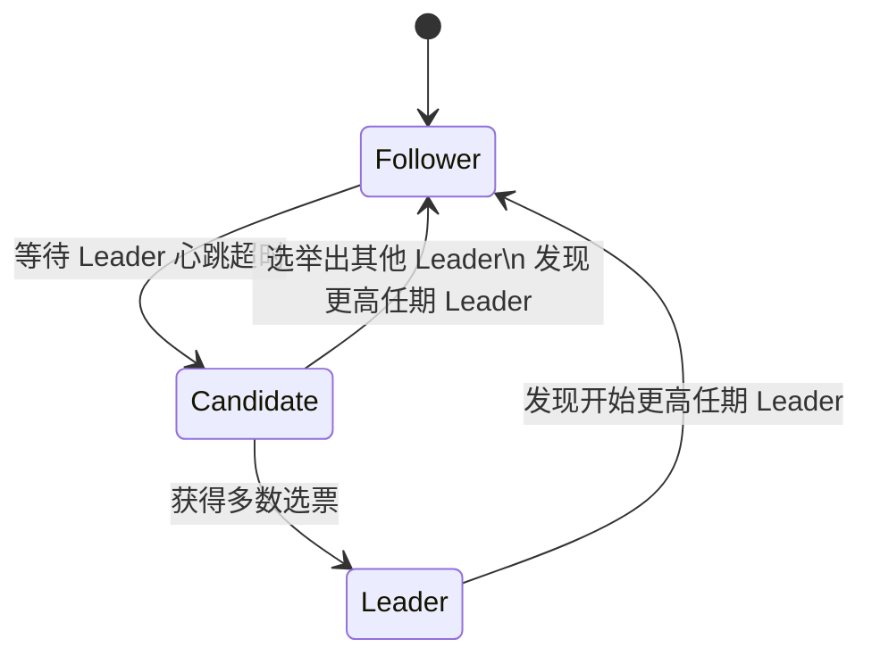

## 简介

RAFT(Reliable, Replicated, Redundant, Fault-Tolerant) 协议是一种分布式共识算法，它的主要特征包括：

- 成员可变

  RAFT 可以在不影响一致性的情况下添加和删除节点, 如增加 Follower 或替换宕机的节点。

- 安全

  RAFT 确保只要大多数节点存活, 集群就可以达到一致性。即使存在失效节点也能正常工作。

- 容易理解

  比 Paxos 等算法容易理解

RAFT 主要解决一致性问题

## 模型和概念

Leader（领导人）：统筹节点，接受和处理请求，复制日志

Follower（跟随者）：只响应 Leader 和 Candidate 请求，复制 Log 到所有 Followers

Candidate（候选人）：负责选举新 Leader

Term（任期）：任期包括选举（产生新的 Leader）和正常运行（发送日志和心跳）两个阶段。如果没有选出领导人，开启下一个任期

选票：用于选举，包含选举人所处 Term 编号，Condidate 只会投票给 Term 编号大于等于自身的节点

复制状态机：相同的初始状态 + 相同的输入 = 相同的结束状态

请求投票（RequestVote RPC）: 由 candidate 再选举期间发起

追加条目（AppendEntries RPC）：由 Leader 发起，用来复制日志和提供心跳

## Raft

Raft 集群启动，每个节点都是 Follower，维护一个计时器，判断当前 Term 是否超时，超时后 Term+1

集群节点全部超时，转化为 Candidate，开始举行选举：

1. 将自身 Term+1
2. 为自己投一票
3. 重置本地计时器
4. 发送投票请求到其他节点
5. 等待下一次计时器超时

## 参考

[Raft 算法系列教程 1：Leader 选举 - 菜鸟学院 (noobyard.com)](http://www.noobyard.com/article/p-axlhpdoc-oa.html)

[蚂蚁金服开源 SOFAJRaft：生产级 Java Raft 算法库 - 掘金 (juejin.cn)](https://juejin.cn/post/6844903795663585293#heading-0)

https://www.bilibili.com/video/BV1BZ4y1U774