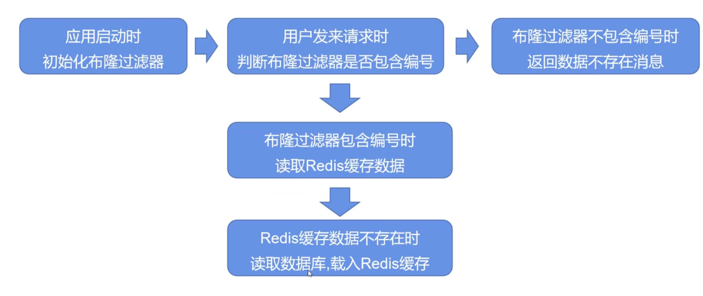

## 简介

布隆过滤器（Bloom Filter）是一种高效的数据结构，通过位数组和多个哈希函数实现，用于检索给定元素是否在一个集合中，适用于海量数据的去重、缓存穿透等场景。

布隆过滤器特点：

+ 如果一个元素在集合中，布隆过滤器能能够检测到
+ 如果一个元素不在集合中，可能会被布隆过滤器认为在集合中，会有误判

布隆过滤器添加元素：

1. 对添加元素应用 k 个哈希函数
2. 得到对应数组 k 个位置
3. 把这些位置的值置为 1

布隆过滤器查询元素：

1. 对查询元素应用 k 个哈希函数
2. 得到对应数组 k 个位置
3. 如果这些位置都为 1，则认为元素存在

减少布隆过滤器误判：

+ 增加二进制位数
+ 增加 hash 次数

## 使用场景

布隆过滤器使用：

+ 添加新数据，会把数据 key 添加到布隆过滤器

+ 删除数据，布隆过滤器无法直接处理，一般使用以下方式解决：

  + 定时异步重建布隆过滤器
  + 使用计数布隆过滤器，标记每个位的使用次数

### 防止缓存穿透

缓存穿透：查询 redis 无数据，去数据库查询，且很有可能数据库也没有该数据

流程：查询 redis 前，使用布隆过滤器判断是否有数据，如果没有直接返回错误。如果有，优先读取 redis 数据，redis
数据不存在时，读取数据库数据并载入缓存。



### 去重

使用布隆过滤器处理要去重的元素，有以下结论

+ 如果元素重复，一定会被检测到认为重复
+ 如果元素不重复，可能会被检测到认为重复

## 使用

### Java Redis 使用 Redisson 客户端

```xml

<dependency>
  <groupId>org.redisson</groupId>
  <artifactId>redisson</artifactId>
  <version>3.6.5</version>
</dependency>
```

```java
public class RedissonBloomFilter {

  public static void main(String[] args) {
    Config config = new Config();
    config.useSingleServer().setAddress("redis://192.168.14.104:6379");
    config.useSingleServer().setPassword("123");
    // 构造 Redisson
    RedissonClient redisson = Redisson.create(config);

    RBloomFilter<String> bloomFilter = redisson.getBloomFilter("phoneList");
    // 初始化布隆过滤器：预计元素为 100000000L, 误差率为 3%
    bloomFilter.tryInit(100000000L,0.03);
    // 将号码 10086 插入到布隆过滤器中
    bloomFilter.add("10086");

    // 判断下面号码是否在布隆过滤器中
    System.out.println(bloomFilter.contains("123456"));//false
    System.out.println(bloomFilter.contains("10086"));//true
  }
}

```

## 参考

[【IT 老齐 008】布隆过滤器在亿级流量电商系统的应用 _ 哔哩哔哩 _bilibili](https://www.bilibili.com/video/BV1eU4y1J7GY/?spm_id_from=333.999.0.0&vd_source=a7294b5d53441a33f427f8cd4d5333c2)

[Redis( 十八) -- 布隆过滤器 _redisson 布隆过滤器 _leo_messi94 的博客 -CSDN 博客 ](https://blog.csdn.net/weixin_39724194/article/details/127430887)