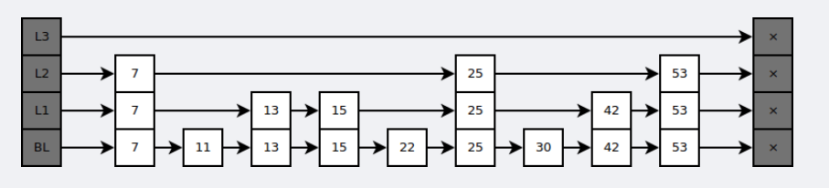
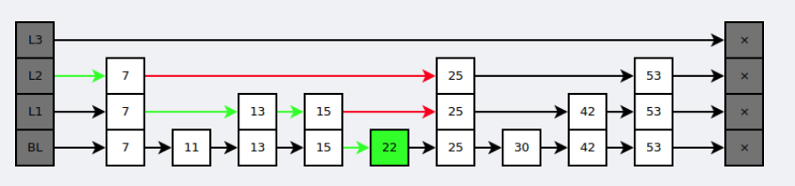
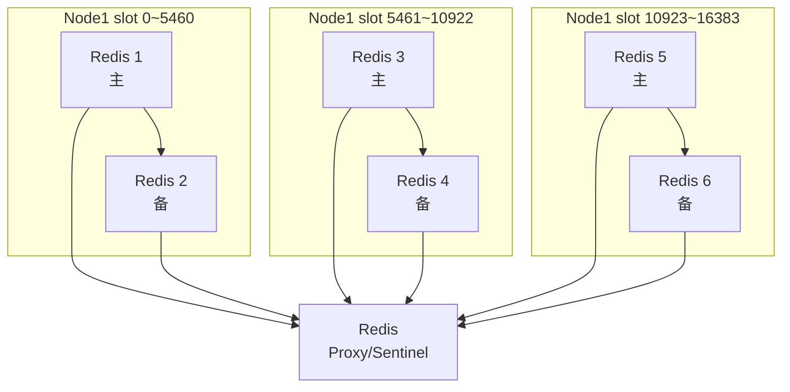

## 简介

Redis是一个非关系型内存数据库，读写非常快，广泛应用于缓存方向。也常做分布式锁

## 概念和模型

### 有序集合ZSet

底层实现是跳跃表

是有序集合的底层实现之一。

跳跃表是基于多指针有序链表实现的，可以看成多个有序链表。



在查找时，从上层指针开始查找，找到对应的区间之后再到下一层去查找。下图演示了查找 22 的过程



与红黑树等平衡树相比，跳跃表具有以下优点：

- 插入速度非常快速，因为不需要进行旋转等操作来维护平衡性；
- 更容易实现；
- 支持无锁操作。

层数应该是logN

跳跃表采用空间换时间的方法，用非严格二分方式构建多级索引

比起红黑树更加直观，更容易实现并发操作

## 数据类型和适用场景

String：可以是数字，常做粉丝数

Hash：存储对象信息

List：实现为一个双向链表，可以做关注列表、消息列表。

Set：共同关注、共同粉丝。

Sorted Set：排行榜

## 常用介绍

### 持久化策略

持久化策略有RDB（Redis DataBase）和AOF（Append Only File）：

#### RDB

在指定时间间隔内将内存中的数据库快照存储在本地磁盘文件中。

适用于有数据大小限制、方便备份的场景。

实现较简单,但无法实时持久化,数据可能丢失。

#### AOF

每个写操作都记录到AOF文件中。

重启时重新执行日志中的写操作恢复数据。

可以实现实时持久化,但性能会稍差,文件体积较大。

AOF重写：将旧AOF文件重写为一个新的AOF文件，大小更新，AOF重写是通过读取数据库键值对来实现。

#### 混合持久化

redis4.0后支持混合持久化。可以快速加载同时避免丢失过多数据。

#### 持久化使用

master关闭持久化，因为影响性能

slave开启RDB即可，必要时AOF和RDB都开启。因为单AOF恢复过慢

以上适用于绝大部分对一致性要求不高的场景

### 数据淘汰策略

redis 提供 6种数据淘汰策略： 

1. volatile-lru：从已设置过期时间的数据集（server.db[i].expires）中挑选最近最少使⽤的数 据淘汰 
2. volatile-ttl：从已设置过期时间的数据集（server.db[i].expires）中挑选将要过期的数据淘 汰 
3. volatile-random：从已设置过期时间的数据集（server.db[i].expires）中任意选择数据淘汰
4. allkeys-lru：当内存不⾜以容纳新写⼊数据时，在键空间中，移除最近最少使⽤的key（这个是 最常⽤的）
5. allkeys-random：从数据集（server.db[i].dict）中任意选择数据淘汰 
6. no-eviction：禁⽌驱逐数据，也就是说当内存不⾜以容纳新写⼊数据时，新写⼊操作会报错。 这个应该没⼈使⽤吧！ 

4.0版本后增加以下两种： 

7. volatile-lfu：从已设置过期时间的数据集(server.db[i].expires)中挑选最不经常使⽤【频率】的数据 淘汰 
8. allkeys-lfu：当内存不⾜以容纳新写⼊数据时，在键空间中，移除最不经常使⽤的key

### 事务

Redis 事务只保证命令执行的顺序性，不保证执行成功与否，简单理解就是执行多个打包在一起的命令

### 缓存雪崩和缓存击穿

雪崩：缓存同一时间大面积失效，大量请求落到数据库上，数据库崩溃

解决：

1. 保持redis集群高可用，选择合适内存淘汰策略。
2. 限流降级本地缓存，避免mysql崩溃
3. 利用redis持久化机制尽快恢复缓存


击穿：查询 redis 没有，查数据库，数据库很有可能也查不到

解决：

1. 布隆过滤器

   把所有可能存在的请求的值都存放在布隆过滤器中，当⽤户请求过来，我会先判断⽤户发来的请求的值是否存在于布隆过滤器中。不存在的话，直接返回请求参数错误信息给客户端

2. 缓存空对象/无效key

### Redis和数据库的同步策略

- 方案1：通过MySQL自动同步刷新Redis，MySQL触发器+UDF函数（自定义函数）实现（UDF函数可以把数据写入Redis中，从而达到同步的效果）
- 方案2：解析MySQL的binlog实现，将数据库中的数据同步到Redis

### 集群

Redis 集群部署有以下几种方式：

+ 主从
+ 哨兵（2.6+）
+ 集群（3.0+）

Redis 的复制方式为异步复制

#### 主从复制

主从部署一般是一主多从，每个节点都有完整数据，用户可以通过执行SLAVEOF命令或者SLAVEOF选项，让从服务器去复制主服务器，从数据库只提供读，不提供写。从库配置里找到这行修改即可

```conf
# replicaof <masterip> <masterport>
replicaof redis-master-service 6379
```

#### 哨兵Sentinel

哨兵是主从复制模式的扩展，用于监控Redis数据库的运行状态，主要功能如下：

1. 监控。监控所有节点数据库是否正常运行
2. 自动故障转移。主数据库故障时，通过自动投票将从数据库选举出主数据库

sentinel是独立的监控程序，不提供数据服务，通常哨兵个数为单数，防止选举主库时选票相同

启动哨兵

```sh
redis-sentinel sentinel.conf
```

哨兵模式主要解决单点故障问题

#### 集群 Redis-Cluster

要求：至少6个节点保证高可用（3主3从）

集群方式采用无中心架构，每个节点都和其他所有节点连接，集群模式是多主多备，备用节点只是提供冷备功能，读写都会落到主节点上




集群模块提供功能：

1. 数据分片。使用HashSlot（默认16384个，分配个多个node）将数据分片分散存储在各个节点上（但依赖客户端，实现更加复杂）

缺点：

1. 单个节点故障后，需要一定时间重新选主和同步数据,会导致部分请求错误
2. 集群划分数据时使用哈希槽,不支持任意键范围的查询命令
3. 读操作需要通过代理发布到整个集群,性能较单机Redis稍差
4. 集群之间的数据一致性无法保障,不适用于需要强一致性的场景
5. 分布式锁和计数功能需要依靠集群内复杂通信协作，性能较单机方式下降


TIP：为什么Slot数量是16k？心跳包固定为2kByte，也就是16k位，表示slot的占用情况，一般而言，Redis集群不会超过这个数量


redis.conf 配置

```conf
appendonly yes
cluster-enabled yes
cluster-config-file/var/lib/redis/nodes.conf
cluster-node-timeout 5000
dir/var/lib/redis
port 6379
```


启动后创建集群

```sh
redis-cli --cluster create 127.0.0.1:7000 127.0.0.1:7001 \
127.0.0.1:7002 127.0.0.1:7003 127.0.0.1:7004 127.0.0.1:7005 \
--cluster-replicas 1
```


Tips:k8s环境下创建集群可以是一个sh脚本的job，查所有的pod获取pod ip，然后创建集群

## 数据设计

### 缓存key设计

redis 是 kv 数据库，没有xx库，xx表之类诸多的概念，如果所有业务系统可以共享一个空间，需要避免 key 重复

一种方法 key 命名方法是 ： `业务名:表名:keyName`

这么做的一个好处是可以使用通配符删除某个业务，某个表所有key

## 参考

[k8s部署redis集群(一) - 掘金 (juejin.cn)](https://juejin.cn/post/7202272345833914428?searchId=202310052032385BDE2CAE88106AF380A4)

[【IT老齐028】大厂必备技能，白话Redis Cluster集群模式_哔哩哔哩_bilibili](https://www.bilibili.com/video/BV1F44y1C7N8/)

[使用 Redis 集群进行扩展](https://redis.io/docs/management/scaling/#create-a-redis-cluster)

[K8S部署Redis集群-v7.0.12（5）_哔哩哔哩_bilibili](https://www.bilibili.com/video/BV1F8411o7n6/)

[记一种不错的缓存设计思路 - 掘金 (juejin.cn)](https://juejin.cn/post/7271597656118394899)