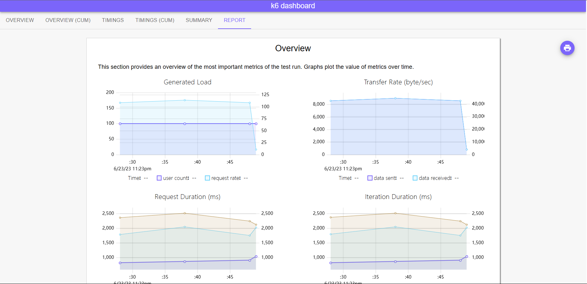

## 简介

k6是一款高性能、现代化、开放源代码的负载测试工具，主要针对JavaScript和Go语言编写的网络应用进行性能测试。k6具有以下主要特点：

1. 现代化的设计：k6采用了现代化的设计，支持ES6语法，并且内置了一些常用的库和工具，如Lodash、Moment、CSV和JSON格式解析器等。

2. 专业的性能测试：k6具有丰富的性能测试功能，如HTTP请求压测、WebSocket测试、服务器性能测试等，可满足各种性能测试需求。

3. 容易上手：k6使用简单，几行代码就可以实现一个简单的性能测试脚本，支持常见的语言和框架。

4. 可扩展性强：k6提供了灵活的扩展机制，支持第三方插件，可以扩展各种测试场景。

5. 开放源代码：k6是一个完全开源的项目，拥有活跃的社区支持，可以自由地使用和定制。

## 安装

k6 支持 docker部署，二进制安装

各平台二进制文件可以在 Github下载：[Releases · grafana/k6 (github.com)](https://github.com/grafana/k6/releases)


k6支持许多插件:

+ dashboard 

+ 结果输出到 es
+ 使用 smtp 发送邮件
+ 用于测试 redis 的客户端
+ 结果输出到 prometheus

插件可以在官网找到：[文档 k6.io - 面向开发人员的性能测试，如针对性能的单元测试](https://k6.io/docs/extensions/get-started/explore/)

## 快速入门

一个 k6 测试脚本一般会有以下几步：

1. 设置虚拟用户
2. 设置测试持续时间
3. 在测试运行时增加减少请求数

### quick-start

新建 quick-start.js

```js
import http from 'k6/http';
import { sleep } from 'k6';

export default function () {
  http.get('http://www.baidu.com');
  sleep(1);
}

```

使用命令运行

```
k6 run quick-start.js
```

输出结果

```shell
PS D:\code\k6\quick-start> k6 run quick-start.js

          /\      |‾‾| /‾‾/   /‾‾/
     /\  /  \     |  |/  /   /  /
    /  \/    \    |     (   /   ‾‾\
   /          \   |  |\  \ |  (‾)  |
  / __________ \  |__| \__\ \_____/ .io

  execution: local
     script: quick-start.js
     output: -

  scenarios: (100.00%) 1 scenario, 1 max VUs, 10m30s max duration (incl. graceful stop):
           * default: 1 iterations for each of 1 VUs (maxDuration: 10m0s, gracefulStop: 30s)


     data_received..................: 387 kB 365 kB/s
     data_sent......................: 79 B   75 B/s
     http_req_blocked...............: avg=8.93ms  min=8.93ms  med=8.93ms  max=8.93ms  p(90)=8.93ms  p(95)=8.93ms
     http_req_connecting............: avg=6.95ms  min=6.95ms  med=6.95ms  max=6.95ms  p(90)=6.95ms  p(95)=6.95ms
     http_req_duration..............: avg=49.26ms min=49.26ms med=49.26ms max=49.26ms p(90)=49.26ms p(95)=49.26ms
       { expected_response:true }...: avg=49.26ms min=49.26ms med=49.26ms max=49.26ms p(90)=49.26ms p(95)=49.26ms
     http_req_failed................: 0.00%  ✓ 0        ✗ 1
     http_req_receiving.............: avg=40.04ms min=40.04ms med=40.04ms max=40.04ms p(90)=40.04ms p(95)=40.04ms
     http_req_sending...............: avg=0s      min=0s      med=0s      max=0s      p(90)=0s      p(95)=0s
     http_req_tls_handshaking.......: avg=0s      min=0s      med=0s      max=0s      p(90)=0s      p(95)=0s
     http_req_waiting...............: avg=9.22ms  min=9.22ms  med=9.22ms  max=9.22ms  p(90)=9.22ms  p(95)=9.22ms
     http_reqs......................: 1      0.943782/s
     iteration_duration.............: avg=1.05s   min=1.05s   med=1.05s   max=1.05s   p(90)=1.05s   p(95)=1.05s
     iterations.....................: 1      0.943782/s
     vus............................: 1      min=1      max=1
     vus_max........................: 1      min=1      max=1


running (00m01.1s), 0/1 VUs, 1 complete and 0 interrupted iterations
default ✓ [======================================] 1 VUs  00m01.1s/10m0s  1/1 iters, 1 per VU
```

### 代码组成

```js
import http from 'k6/http';
import { sleep } from 'k6';

// 初始化，该部分每个 虚拟用户（vu） 只会执行一次
// ... code

// 选项，指示脚本的配置项，包括阶段等等
export const options = {
  
};

export default function () {
  // vu code:每个虚拟用户行为
}

```

### 多用户并发压测

通过选项，可以快速模拟多用户测试

新建 quick-start-vu.js

```js
import http from 'k6/http';
import { sleep } from 'k6';

export const options = {
  vus: 100, // 100 个虚拟用户
  duration: '30s', // 持续30s
};

export default function () {
  http.get('http://www.baidu.com');

}

```

### 变化式负载

可以通过配置选项指定负载变化情况

下面的例子演示了如何更改每秒请求次数

```js
export const options = {
  scenarios: {
    contacts: {
      executor: 'ramping-arrival-rate',
      preAllocatedVUs: 50,
      timeUnit: '1s',
      startRate: 50,
      stages: [
        { target: 200, duration: '30s' }, // 30s内线性增长请求次数，从50增长到200次/s
        { target: 500, duration: '0' }, // 每秒请求次数增长到500次/s
        { target: 500, duration: '10m' }, // 保持10分钟
      ],
    },
  },
};

```

下面的例子演示了如何更改 VU 数量

```js
export const options = {
  scenarios: {
    contacts: {
      executor: 'ramping-vus',
      preAllocatedVUs: 10,
      startVUs: 3,
      stages: [
        { target: 20, duration: '30s' }, // linearly go from 3 VUs to 200 VUs for 30s
        { target: 100, duration: '0' }, // instantly jump to 100 VUs
        { target: 100, duration: '10m' }, // continue with 100 VUs for 10 minutes
      ],
    },
  },
};

```


### dashboard

dashboard 是一个 k6 插件，可以在下面这里下载:[GitHub - szkiba/xk6-dashboard: A k6 extension that enables creating web based metrics dashboard for k6](https://github.com/szkiba/xk6-dashboard#download)

使用打包了 dashboard 插件的 k6，即可在压测时同时在网页展示结果
```sh
k6 run  --out dashboard .\quick-start-vu.js
```



## 执行模式

k6支持三种执行模式：

+ 本地

+ 分布式

  主要提供 k8s 支持，设置并行度指标测试：[Running distributed k6 tests on Kubernetes](https://k6.io/blog/running-distributed-tests-on-k8s/)

+ 云

  主要是公有云服务


## 使用

### HTTP 请求

提供 HTTP 模块 [k6/http](https://k6.io/docs/javascript-api/k6-http/)

#### 发送一个带payload 的 post请求

新建  http

```js
import http from 'k6/http';

export default function () {
  const url = 'http://test.k6.io/login';
  const payload = JSON.stringify({
    email: 'aaa',
    password: 'bbb',
  });

  const params = {
    headers: {
      'Content-Type': 'application/json',
    },
  };

  http.post(url, payload, params);
}

```

#### 将网址分组聚合到一个tag

新建 grouping.js

```js
import http from 'k6/http';

export default function () {
    for (let id = 1; id <= 10; id++) {
        http.get(`http://example.com/posts/${id}`);
    }
}
// tags.name=\"http://example.com/posts/1\",
// tags.name=\"http://example.com/posts/2\",
```

这十个请求 tag 名字都不同，如果想把它们聚合为一类分析，可以手动指定 tag

```js
import http from 'k6/http';

export default function () {
  for (let id = 1; id <= 100; id++) {
    http.get(`http://example.com/posts/${id}`, {
      tags: { name: 'PostsItemURL' },
    });
  }
}
// tags.name=\"PostsItemURL\",
// tags.name=\"PostsItemURL\",

```

或者可以用模板的方法设置 tag 名

```js
import http from 'k6/http';

export default function () {
  for (let id = 1; id <= 100; id++) {
    http.get(http.url`http://example.com/posts/${id}`);
  }
}
// tags.name="http://example.com/posts/${}",
// tags.name="http://example.com/posts/${}",

```
#### 方法参考表

| FUNCTION                                                     | DESCRIPTION                                                  |
| :----------------------------------------------------------- | :----------------------------------------------------------- |
| [batch( requests )](https://k6.io/docs/javascript-api/k6-http/batch) | 同时发出多个HTTP请求                                         |
| [cookieJar()](https://k6.io/docs/javascript-api/k6-http/cookiejar-method) | 获取活动的cookies jar对象                                    |
| [del( url, [body\], [params] )](https://k6.io/docs/javascript-api/k6-http/del) | DELETE方法                                                   |
| [file( data, [filename\], [contentType] )](https://k6.io/docs/javascript-api/k6-http/file) | 创建一个用于 multi-part 请求的文件.                          |
| [get( url, [params\] )](https://k6.io/docs/javascript-api/k6-http/get) | GET                                                          |
| [head( url, [params\] )](https://k6.io/docs/javascript-api/k6-http/head) | HEAD                                                         |
| [options( url, [body\], [params] )](https://k6.io/docs/javascript-api/k6-http/options) | OPTIONS                                                      |
| [patch( url, [body\], [params] )](https://k6.io/docs/javascript-api/k6-http/patch) | PATCH                                                        |
| [post( url, [body\], [params] )](https://k6.io/docs/javascript-api/k6-http/post) | POST                                                         |
| [put( url, [body\], [params] )](https://k6.io/docs/javascript-api/k6-http/put) | PUT                                                          |
| [request( method, url, [body\], [params] )](https://k6.io/docs/javascript-api/k6-http/request) | HTTP请求                                                     |
| [asyncRequest( method, url, [body\], [params] )](https://k6.io/docs/javascript-api/k6-http/asyncrequest) | 异步HTTP请求                                                 |
| [setResponseCallback(expectedStatuses)](https://k6.io/docs/javascript-api/k6-http/setresponsecallback) | Sets a response callback to mark responses as expected.      |
| [url`url`](https://k6.io/docs/javascript-api/k6-http/urlurl) | Creates a URL with a name tag. Read more on [URL Grouping](https://k6.io/docs/using-k6/http-requests#url-grouping). |
| [expectedStatuses( statusCodes )](https://k6.io/docs/javascript-api/k6-http/expectedstatuses) | Create a callback for setResponseCallback that checks status codes. |

| CLASS                                                        | DESCRIPTION                                                  |
| :----------------------------------------------------------- | :----------------------------------------------------------- |
| [CookieJar](https://k6.io/docs/javascript-api/k6-http/cookiejar) | 用于存储cookies，由服务端或客户端设置                        |
| [FileData](https://k6.io/docs/javascript-api/k6-http/filedata) | Used for wrapping data representing a file when doing multipart requests (file uploads). |
| [Params](https://k6.io/docs/javascript-api/k6-http/params)   | Used for setting various HTTP request-specific parameters such as headers, cookies, etc. |
| [Response](https://k6.io/docs/javascript-api/k6-http/response) | Returned by the http.* methods that generate HTTP requests.  |

### 指标

#### 标准指标

所有协议，k6 都会有以下指标

| METRIC NAME        | TYPE    | DESCRIPTION                                                  |
| :----------------- | :------ | :----------------------------------------------------------- |
| vus                | Gauge   | 当前活跃虚拟用户数                                           |
| vus_max            | Gauge   | 最大虚拟用户数量（VU资源是预分配的，以避免在扩大负载时影响性能） |
| iterations         | Counter | VUs执行JS脚本（default 函数）的次数总和                      |
| iteration_duration | Trend   | 完成一个完整的迭代所需的时间，包括设置和拆除所花费的时间。如果要计算特定情况下迭代函数的持续时间，请尝试使用此解决方法https://k6.io/docs/using-k6/workaround-to-calculate-iteration_duration |
| dropped_iterations | Counter | 因为虚拟用户不足而未能开始的迭代次数（对于到达速率执行器）或时间不足（基于迭代的执行器中已过期的最大持续时间）。关于被丢弃的迭代 [About dropped iterations](https://k6.io/docs/using-k6/scenarios/concepts/dropped-iterations/) |
| data_received      | Counter | 接收到的数据量，示例如何跟踪个别网址数据 [This example covers how to track data for an individual URL](https://k6.io/docs/examples/track-transmitted-data-per-url). |
| data_sent          | Counter | 发送的数据量，示例如何跟踪单个URL：[Track data for an individual URL](https://k6.io/docs/examples/track-transmitted-data-per-url) |
| checks             | Rate    | 成功 checks 的占比                                           |

#### HTTP 指标

http 指标以 http_req_ 开头

| METRIC NAME              | TYPE    | DESCRIPTION                                                  |
| :----------------------- | :------ | :----------------------------------------------------------- |
| http_reqs                | Counter | k6 总共生成了多少个 HTTP 请求。                              |
| http_req_blocked         | Trend   | 启动请求之前阻塞（等待空闲 TCP 连接）时间                    |
| http_req_connecting      | Trend   | 与远程主机建立 TCP 连接所花费的时间                          |
| http_req_tls_handshaking | Trend   | 与远程主机握手 TLS 会话所花费的时间                          |
| http_req_sending         | Trend   | 与远程主机握手 TLS 会话所花费的时间                          |
| http_req_waiting         | Trend   | 等待远程主机响应所花费的时间（也称为“到第一个字节的时间”或“TTFB”） |
| http_req_receiving       | Trend   | 从远程主机接收响应数据所花费的时间                           |
| http_req_duration        | Trend   | 请求的总时间。它等于http_req_sending + http_req_waiting + http_req_receiving（即远程服务器在没有初始 DNS 查找/连接时间的情况下处理请求和响应所需的时间） |
| http_req_failed          | Rate    | 根据以下条件的失败请求率 [setResponseCallback](https://k6.io/docs/javascript-api/k6-http/setresponsecallback). |

#### 浏览器模块指标

核心指标

| CORE WEB VITAL                   | DESCRIPTION                                                  |
| :------------------------------- | :----------------------------------------------------------- |
| webvital_largest_content_paint   | 测量页面的加载性能。更多信息参考[Largest Contentful Paint](https://web.dev/lcp/) |
| webvital_first_input_delay       | 测量页面的交互延迟。更多信息参考 [First Input Delay](https://web.dev/fid/) |
| webvital_cumulative_layout_shift | 测量页面的视觉稳定性。更多信息参考 [Cumulative Layout Shift](https://web.dev/cls/) |

其他指标

| OTHER WEB VITAL                    | DESCRIPTION                                                  |
| :--------------------------------- | :----------------------------------------------------------- |
| webvital_time_to_first_byte        | 测量从浏览器请求到服务器响应开始之间所花费的时间.更多信息参考 [Time to First Byte](https://web.dev/ttfb/) |
| webvital_first_contentful_paint    | 测量浏览器在页面上呈现第一个 DOM 元素所需的时间，无论是文本、图像还是标题. 更多信息参考 [First Contentful Paint](https://web.dev/fcp/) |
| webvital_interaction_to_next_paint | A衡量页面响应能力的实验性指标.更多信息参考 [Interaction to Next Paint](https://web.dev/inp/) |

#### websocket 指标

| METRIC NAME         | TYPE    | DESCRIPTION                                                  |
| :------------------ | :------ | :----------------------------------------------------------- |
| ws_connecting       | Trend   | WebSocket 连接请求的总持续时间。                             |
| ws_session_duration | Trend   | WebSocket 会话的持续时间指的是连接开始和虚拟用户执行结束之间的时间。 |
| ws_sessions         | Counter | 已启动的WebSocket会话数量总数                                |
| ws_ping             | Trend   | ping请求和接收到pong响应之间的时间间隔                       |
| ws_msgs_sent        | Counter | 发送消息的总数                                               |
| ws_msgs_received    | Counter | 收到的消息总数                                               |

#### gRPC 指标

| METRIC NAME                | TYPE    | DESCRIPTION              |
| :------------------------- | :------ | :----------------------- |
| grpc_req_duration          | Trend   | 收到远程主机的响应的时间 |
| grpc_streams               | Counter | 已启动流的总数           |
| grpc_streams_msgs_sent     | Counter | 发送的消息总数           |
| grpc_streams_msgs_received | Counter | 接收的消息总数           |

#### 自定义指标

支持自定义指标类型:

+ counter
+ gauge
+ rate
+ trend

具体参考：[Create custom metrics (k6.io)](https://k6.io/docs/using-k6/metrics/create-custom-metrics/)

### checks

验证测试是否满足预期

#### 检查 http 状态码

```js
import { check } from 'k6';
import http from 'k6/http';

export default function () {
  const res = http.get('http://test.k6.io/');
  check(res, {
    'is status 200': (r) => r.status === 200,
  });
}

```

#### 检查 http 响应内容

```js
import { check } from 'k6';
import http from 'k6/http';

export default function () {
  const res = http.get('http://test.k6.io/');
  check(res, {
    'verify homepage text': (r) =>
      r.body.includes('Collection of simple web-pages suitable for load testing'),
  });
}

```

#### 检查 http 响应正文小大

```js
import { check } from 'k6';
import http from 'k6/http';

export default function () {
  const res = http.get('http://test.k6.io/');
  check(res, {
    'body size is 11,105 bytes': (r) => r.body.length == 11105,
  });
}
```

#### 查看检查通过情况

运行脚本，可以看到 check name中包含了我们定义的checks情况，下面表示全部响应均通过

```sh
k6 run script.js

  ...
    ✓ is status 200

  ...
  checks.........................: 100.00% ✓ 1        ✗ 0
  data_received..................: 11 kB   12 kB/s

```

### 阈值

阈值是你为指标定义的通过/失败条件，例如你可以组合以下几个条件

- 不到 1% 的请求返回错误。
- 95% 的请求的响应时间低于 200 毫秒。
- 99% 的请求的响应时间低于 400 毫秒。
- 特定端点始终在 300 毫秒内响应。
- 任何条件[自定义指标](https://k6.io/docs/using-k6/metrics/create-custom-metrics).

这是一个例子

```js
import http from 'k6/http';

export const options = {
  thresholds: {
    http_req_failed: ['rate<0.01'], // http errors should be less than 1%
    http_req_duration: ['p(95)<200'], // 95% of requests should be below 200ms
  },
};

export default function () {
  http.get('https://test-api.k6.io/public/crocodiles/1/');
}

```

TODO：补充

### 选项

可用选项参考:[选项参考 (k6.io)](https://k6.io/docs/using-k6/k6-options/reference/)

## 参考

[k6 Examples & Tutorials](https://k6.io/docs/examples/)
