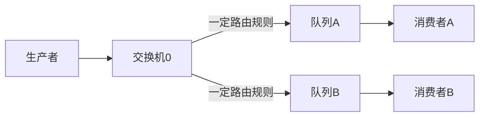

## 简介

RabbitMQ是使用Erlang语言开发的开源消息队列系统，基于AMQP协议来实现。AMQP的主要特征是面向消息、队列、路由（包括点对点和发布/订阅）、可靠性、安全。AMQP协议更多用在企业系统内对数据一致性、稳定性和可靠性要求很高的场景，对性能和吞吐量的要求还在其次。

优点：可靠性高，延迟低

缺点：吞吐较低

## 消息模型

Vhost：虚拟主机，用于隔离不同服务

Exchange（交换机）：生产者发送消息到交换机，交换机再根据自身类型和规则把消息发送到 Queue

Queue（队列）：存储消息，提供给消费者消费

RoutingKey：路由规则描述

消息的RoutingKey：描述消息特征，例如可以给创建用户的消息带上`user.create`

队列的RoutingKey：描述队列接收的消息特征，例如可以给队列指定从交换机0接收消息，RoutingKey为`user.*`，表示接创建用户，更新用户等消息

Binding（绑定）：描述交换机和队列的关联关系

一般来说，带有交换机的消息模型如上

### 交换机和RoutingKey

RabbitMQ 交换机有多种类型，支持不同的匹配规则，并按照规则转发到指定队列

| 交换机类型 | 描述                                                         |
| ---------- | ------------------------------------------------------------ |
| Direct     | 在消息路由时，根据消息的routing key完全匹配进行转发。        |
| Topic      | 在消息路由时，根据消息的routing key和通配符模式进行转发。    |
| Fanout     | 将消息广播到所有绑定到交换机的队列中。忽略routing key。      |
| Headers    | 在消息路由时，根据消息的headers进行匹配和转发。              |
| Default    | RabbitMQ默认的交换机类型。直接将消息发送到与消息的routing key匹配的队列中。如果没有匹配的队列，消息将被丢弃。 |

Topic交换机支持两种通配符：`*`（星号）和 `#`（井号）

1. 星号（`*`）：可以匹配一个单词。 例如，`a.*` 可以匹配 `a.b`、`a.c`，但不会匹配 `a.b.c`。
2. 井号（`#`）：可以匹配零个或多个单词。 例如，`a.#` 可以匹配 `a.b`、`a.b.c`、`a.b.c.d` 等

注意：

- 单词之间使用点号来分隔。
- 通配符只能匹配单级或多级单词，并不能匹配特定字符。
- 可以在同一个Topic交换机中结合使用多个通配符来实现更灵活的路由匹配。

## 命令行工具

RabbitMQ命令工具主要有以下几种：

1. rabbitmqctl：用于管理RabbitMQ服务器的命令行工具。它可以用于创建、删除和管理队列、交换机、绑定和用户等。
2. rabbitmq-plugins：用于管理RabbitMQ插件的命令行工具。它可以用于启用、禁用和列出已安装的插件。
3. rabbitmqadmin：一个用于管理RabbitMQ服务器的Web界面。它提供了一个基于HTTP的GUI，可以用于执行与rabbitmqctl相同的操作。
4. rabbitmq-diagnostics：用于诊断RabbitMQ服务器的命令行工具。它可以提供有关服务器性能、连接状态和节点信息的详细信息。
5. rabbitmq-server：RabbitMQ服务器本身的启动命令。它用于启动、停止或重新启动RabbitMQ服务器。

### rabbitmqctl

#### 管理

rabbitmqctl list_connections：列出当前RabbitMQ服务器上的所有连接

#### 用户

rabbitmqctl list_users：列出当前RabbitMQ服务器上的所有用户

rabbitmqctl add_user <username> <password>：添加一个新的用户，并设置密码。

rabbitmqctl delete_user <username>：删除指定的用户

#### 权限

rabbitmqctl list_permissions：列出当前RabbitMQ服务器上的所有权限

rabbitmqctl set_permissions -p <vhost_name> <username> <permission> <read_permission> <write_permission> <configure_permission>：为指定用户设置权限。

#### vhost

rabbitmqctl list_vhosts：列出当前RabbitMQ服务器上的所有虚拟主机

rabbitmqctl add_vhost <vhost_name>：添加一个新的虚拟主机

## 集群

## 参考

[RabbitMQ基础复习 - 掘金 (juejin.cn)](https://juejin.cn/post/7248914499914481725?searchId=202307171110097CEC7B6AC00F6705B0AF)