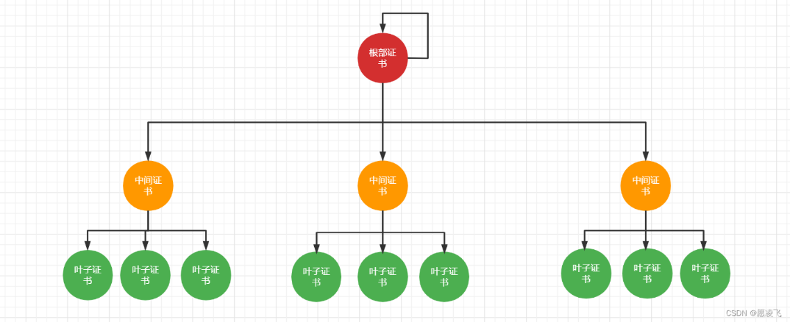
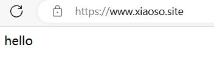

## 简介

X.509 是密码学里公钥证书的格式标准。

X.509 证书里含有公钥、身份信息（比如网络主机名，组织的名称或个体名称等）和签名信息（可以是证书签发机构 CA 的签名，也可以是自签名）

证书可以给别的证书进行签名，被签名的证书叫中间证书，未被签名的公钥证书或自签名的证书叫根证书。

只要信任根证书，证书链中的证书（中间证书、叶子证书）也会被信任。使用根证书，可以验证下属证书是否可信。



### 用途

常用作 HTTPS 认证

### 编码格式

X.509 证书主要有两种格式：

+ der 格式：二进制格式
+ pem 格式：pem 格式的文件是普通的文本文件，实际内容进行了某些编码（如 Base64 编码），得到的数据需要进行增加或裁剪特殊字符

### 文件扩展名

| 扩展名    | 编码格式                                                     |
| --------- | ------------------------------------------------------------ |
| .pem      | 采用 pem 编码格式文件                                          |
| .der      | 采用 der 编码格式文件                                          |
| .crt      | 可能是 pem 编码，也可能是 der 编码。但大多数情况下为 pem 编码的证书 |
| .cer      | 可能是 pem 编码，也可能是 der 编码。但大多数情况下为 der 编码的数字证书 |
| .p7b/.p7c | PKCS 7 数据格式,签名文件，只包含证书文件                      |
| .p12      | PKCS12 格式，通常包含了私钥 private key 和公钥 key（certificate） |

其他不相关扩展名

| 扩展名 | 编码格式                                                     |
| ------ | ------------------------------------------------------------ |
| .key   | 通常用来存放一个公钥或者私钥，并非 X.509 证书，编码同样的，可能是 pem，也可能是 der |

## 术语

CA：证书授权中心

CA 证书：证书授权中心颁发的证书

自签名证书：自己签名而不是 CA 签名的证书

根证书：未被签名的公钥证书或自签名的证书

叶子证书（终端证书）：给申请者使用的证书

证书请求（CSR）：数字签名申请者使用私钥生成，提交给 CA 机构的文件，该文件经过 CA 机构签名后得到公钥证书

PKCS 系列标准：公钥密码学标准，常用有 PKCS#12（p12），p12 是 X.509 的一种实现

## OpenSSL

OpenSSL 是一个开源软件库，实现了基本加密功能，实现了 SSL、TLS 协议。

详细了解：

+ [OpenSSL 中文手册 ](https://www.openssl.net.cn/)

+ [官方命令文档 ](https://www.openssl.org/docs/manmaster/man1/openssl-req.html)

### 快速开始

Windows 下载：[OpenSSL-windows](http://slproweb.com/products/Win32OpenSSL.html) 或 [OpenSSL-码客 ](https://oomake.com/download/openssl)

启动 `start.bat`或者把安装目录加入环境变量，即可运行

### 示例

#### 简单创建一个 SSL 证书

```bash
 openssl req -x509 -newkey rsa:2048 -keyout key.pem -out ca.crt
```

| 参数                | 说明                                                         |
| ------------------- | ------------------------------------------------------------ |
| -x509               | 生成证书，而不是证书请求                                     |
| -newkey [ras:]nbits | 生成证书请求或者自签名证书的时候自动生成大小为 nbits 的 rsa 私钥 |
| keyout              | 输出私钥文件                                                 |
| out                 | 输出证书文件                                                 |

会提示你 `Enter PEM pass phrase` 要求你输入 PEM 密码，需要 4-511 个字符。剩下的签发国家、邮箱之类信息可以一路回车跳过。

现在得到私钥 `key.pem`和证书 `ca.crt`

生成 pkcs12 标准证书

```bash
openssl pkcs12 -export -clcerts -in ca.crt -inkey key.pem -out ca.p12
```

现在得到 `ca.p12` 证书

## 使用

### 证书生成

#### 根证书生成步骤

1. 生成私钥文件（.key）
2. 生成证书请求（.csr）
3. 使用私钥对证书请求自签名得到根证书（.crt）

首先准备配置文件 `ca.conf`

```conf
[ req ]
default_bits       = 4096
distinguished_name = req_distinguished_name

[ req_distinguished_name ]
countryName                 = Country Name (2 letter code)
countryName_default         = CN
stateOrProvinceName         = State or Province Name (full name)
stateOrProvinceName_default = GuangXi
localityName                = Locality Name (eg, city)
localityName_default        = NanNing
organizationName            = Organization Name (eg, company)
organizationName_default    = MyOrg0
commonName                  = Common Name (e.g. server FQDN or YOUR name)
commonName_max              = 64
commonName_default          = Xisoso CA Test
```

首先生成私钥文件 `ca.key`

```bash
openssl genrsa -out ca.key 4096
```

根据私钥生成证书请求 `ca.csr`

```bash
openssl req -new -sha256 -out ca.csr -key ca.key -config ca.conf
```

使用私钥给证书请求签名，生成根证书 `ca.crt`

```bash
openssl x509 -req -days 3650 -in ca.csr -signkey ca.key -out ca.crt
```

#### 生成叶子证书

1. 生成私钥文件（.key）
2. 生成证书请求（.csr）
3. 使用根证书对证书请求签名，生成叶子证书

准备配置文件 `server.conf`

```conf
[ req ]
default_bits       = 2048
distinguished_name = req_distinguished_name
req_extensions     = req_ext

[ req_distinguished_name ]
countryName                 = Country Name (2 letter code)
countryName_default         = CN
stateOrProvinceName         = State or Province Name (full name)
stateOrProvinceName_default = GuangDong
localityName                = Locality Name (eg, city)
localityName_default        = GuangZhou
organizationName            = Organization Name (eg, company)
organizationName_default    = MyOrg1
commonName                  = Common Name (e.g. server FQDN or YOUR name)
commonName_max              = 64
commonName_default          = www.xiaoso.com

[ req_ext ]
subjectAltName = @alt_names

[alt_names]
DNS.1   = www.xiaoso.com
DNS.2   = www.xiaoso.site
IP      = 127.0.0.1
```

:::tip 提示

alt_names 中 DNS 可以使用通配符

:::

生成私钥 `server.key`

```bash
openssl genrsa -out server.key 2048
```

使用私钥生成证书请求 `server.csr`

```bash
openssl req -new -sha256 -out server.csr -key server.key -config server.conf
```

使用证书（根证书或中间证书）生成叶子证书 `server.crt`

```bash
openssl x509 -req -days 3650 -CA ca.crt -CAkey ca.key -CAcreateserial -in server.csr -out server.crt -extensions req_ext -extfile server.conf
```

### 证书使用

#### 系统浏览器添加证书信任

##### 添加证书信任

由于是自签证书，首先要添加本地证书信任

Windows：右键 `ca.crt`，选择 `安装证书`，放入到 `受信任的根证书颁发机构`

##### 添加 hosts

添加 hosts 是为了方便本地测试，配置本地 hosts 文件，添加

```hosts
127.0.0.1 www.xiaoso.site
127.0.0.1 www.xiaoso.com
```

#### 服务端

##### Nginx

把 `server.crt` 和 `server.key` 放到 Nginx 的 conf  文件夹下，修改 `nginx.conf` 配置文件如下

```conf
...省略
http {
  	...省略 http 服务
    server {
       listen       443 ssl;
       server_name  localhost;

       ssl_certificate      server.crt;
       ssl_certificate_key  server.key;

       ssl_session_cache    shared:SSL:1m;
       ssl_session_timeout  5m;

       ssl_ciphers  HIGH:!aNULL:!MD5;
       ssl_prefer_server_ciphers  on;

       location / {
           root   html;
           index  index.html index.htm;
       }
    }
}

```

启动 Nginx 服务器，访问 http://www.xiaoso.site 或 http://www.xiaoso.com 可以看到浏览器地址栏显示已经建立安全连接

##### SpringBoot

首先需要签发一个 `pkcs12` 标准，后缀为`.p12`的证书

```bash
openssl pkcs12 -export -clcerts -in server.crt -inkey server.key -out server.p12
```

输入 Enter Export Password  `1234` 得到 `server.p12` 证书文件

新建一个 SpringBoot Web 项目，编辑 `application.properies` 文件

```properties
server.port=443
security.require-ssl=true
server.ssl.key-store-password=1234
server.ssl.keyStoreType=PKCS12
server.ssl.key-store=src/main/resources/server.p12
```

把 `server.p12` 放入到 `src/main/resources` 目录下

新建一个方法，显示首页内容

```java
    @GetMapping("/")
    public String sayHello(){
        return "hello";
    }
```

启动 SpringBoot 工程，打开 https://www.xiaoso.site




#### 客户端

##### Java-OKHTTP3

新建一个 Java Maven 工程，引入 Maven 依赖

```xml
<dependency>
    <groupId>com.squareup.okhttp3</groupId>
    <artifactId>okhttp</artifactId>
    <version>3.14.9</version>
</dependency>
```

把 `ca.crt` 放入到 `src/main/resources/`文件夹下

新建 `X509Test.java`，代码示例如下
::: details 点击查看代码
```java
import okhttp3.Call;
import okhttp3.OkHttpClient;
import okhttp3.Request;
import okhttp3.Response;

import javax.net.ssl.*;
import java.io.FileInputStream;
import java.io.IOException;
import java.io.InputStream;
import java.security.*;
import java.security.cert.CertificateException;
import java.security.cert.CertificateFactory;

public class X509Test {
    public static void main(String[] args) throws CertificateException, IOException, NoSuchAlgorithmException, KeyStoreException, UnrecoverableKeyException, KeyManagementException {

        // 获取秘钥存储库 keyStore
        KeyStore keyStore = KeyStore.getInstance(KeyStore.getDefaultType());
        keyStore.load(null);

        // 把证书放到秘钥存储库
        InputStream certificate = new FileInputStream("src/main/resources/ca.crt");
        String certificateAlias = "ca-root";
        CertificateFactory certificateFactory = CertificateFactory.getInstance("X.509");
        keyStore.setCertificateEntry(certificateAlias, certificateFactory.generateCertificate(certificate));

        // 获取信任管理器工厂，用 keyStore 初始化信任管理器工厂
        TrustManagerFactory trustManagerFactory = TrustManagerFactory.getInstance(TrustManagerFactory.getDefaultAlgorithm());
        trustManagerFactory.init(keyStore);

        // 获取秘钥管理器工厂，用 keyStore 和密码 1234 初始化秘钥管理器工厂
        KeyManagerFactory keyManagerFactory = KeyManagerFactory.getInstance(KeyManagerFactory.getDefaultAlgorithm());
        keyManagerFactory.init(keyStore, "1234".toCharArray());

        // 获取 SSL 上下文实例，用信任管理器、秘钥管理器、指定算法初始化 SSL 上下文，获取 SSL socket 工厂
        SSLContext sslContext = SSLContext.getInstance("TLS");
        sslContext.init(keyManagerFactory.getKeyManagers(), trustManagerFactory.getTrustManagers(), new SecureRandom());
        SSLSocketFactory sslSocketFactory = sslContext.getSocketFactory();

		// 注意这里只取用了第一个信任管理器，并且认为是 X509 信任管理器
        OkHttpClient okHttpClient = new OkHttpClient.Builder()
                .sslSocketFactory(sslSocketFactory, (X509TrustManager) trustManagerFactory.getTrustManagers()[0])
                .build();
        
		// 构造请求
        Request request = new Request.Builder()
                .get()
                .url("https://www.xiaoso.site")
                .build();

        Call call = okHttpClient.newCall(request);
        Response response = call.execute();
        System.out.println(response.body().string());

    }
}

```
:::
::: warning 警告

为了代码清晰忽略了所有异常，并且获取信任管理器并转型为 `X509TrustManager`时没有考虑数组越界和转型问题。

:::

##### Python-Requests

新建 `test.py`，把 `ca.crt` 放到同级目录下

```python
import ssl
import requests

r = requests.get("https://www.xiaoso.site",verify='ca.crt')
print(r.status_code)
print(r.text)
print(r.headers)
```


## 参考

[HTTPS 中的证书、SSL 证书、X509 证书 初探 讲解_ssl x509](https://blog.csdn.net/tianpengfei123/article/details/125238315)

[OpenSSL 生成 CA 证书及终端用户证书 ](https://www.cnblogs.com/nidey/p/9041960.html)

