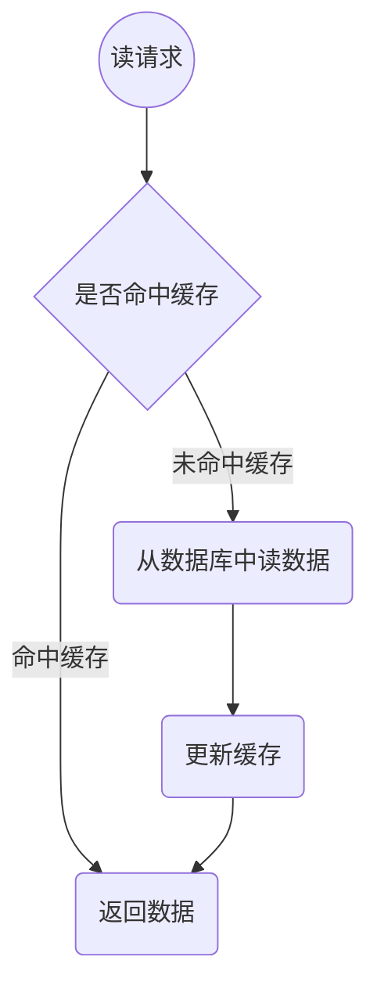
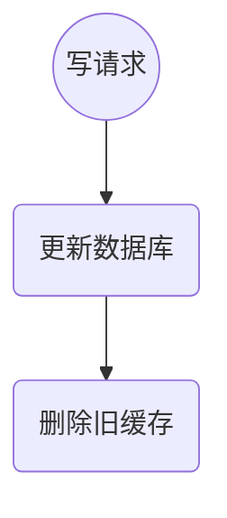

## 简介

缓存双写一致性是指在缓存和数据库中同时进行更新操作，并且保证最终一致性。

缓存双写一般认为是一致性问题，例如同时写 mysql 和 redis，如果 mysql 写成功，redis 写失败，那么会导致数据不一致。或者 mysql
写成功，redis 还没写入，就有另外的线程读数据，也会造成数据不一致。

对于数据不一致问题一般根据一致性要求，针对采用不同的方法解决

## 数据一致性

### 强一致性

强一致性是指在数据更新时，必须同时更新到缓存和数据库，并且在更新完成后，缓存和数据库的数据保持一致。

### 弱一致性

弱一致性是指在数据更新时，只要更新到缓存或数据库，不承诺数据什么时候会更新到另一个。只要缓存和数据库的数据保持一致即可。

#### 最终一致性

最终一致性是弱一致性的一个特例，系统会保证在一定时间内，能够达到一个数据一致的状态。

## 缓存模式

### Cache-Aside Pattern

旁路缓存模式，尽可能解决缓存和数据库不一致，属于最终一致性方案

缺点：

1. 第一次请求性能较差，需要从主数据源加载数据。

2. 缓存命中率低时，主数据源可能会成为性能瓶颈。

非一致性状态：

1. 写请求先更新数据库，此时如果有另外一个读请求，可能读取非最新数据

#### read

读流程：

1. 先读缓存，缓存命中则返回
2. 缓存不命中，读数据库
3. 把数据库数据写入缓存
4. 返回数据

#### write

写流程：

1. 更新数据库
2. 删除旧缓存

### Read-Through/Write-Through（读穿透 / 写穿透）

读写穿透逻辑和 cache-aside 一致，只不过多了一层包装，把读写数据源和缓存封装为方法，让外部对缓存无感

### write behind （异步缓存写入）

简单来说就是只更新缓存，然后通过批量异步的方式更新数据库，一致性程度低

## 参考

[美团二面：Redis 与 MySQL 双写一致性如何保证？ - 掘金 (juejin.cn)](https://juejin.cn/post/6964531365643550751)
